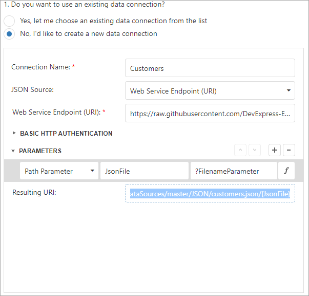
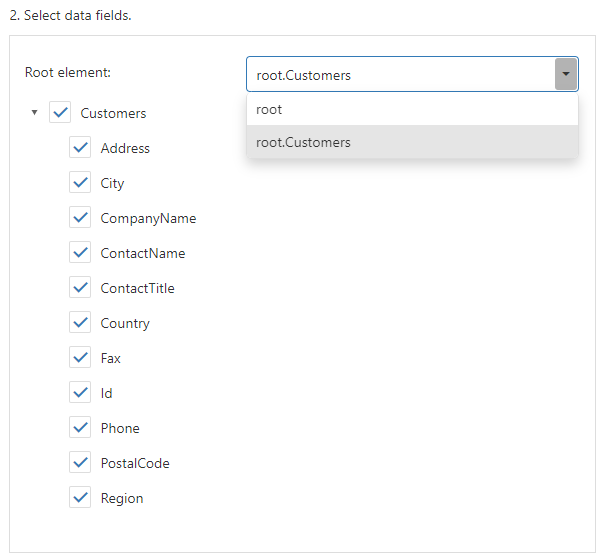

# Bind a Report to JSON Data

This topic describes how to bind a report to JSON data at design time.

## Add a New Data Source

1. Invoke the designer [menu](../report-designer-tools/menu.md) and click **Add Data Source...**.
	
    

    This invokes the Data Source Wizard.

2. Choose the **JSON** option and click **Next**.
	
    

3. The next wizard page allows you to specify whether you want to use an existing data connection or create a new data connection.

    

    

    If you prefer to create a new data connection, specify its settings. You can use a Web Service Endpoint, a filename, or a string with JSON data. In this example, the JSON data is obtained from a [JSON sample data location](https://northwind.now.sh/api/customers).

    

    Specify request parameters (username and password, HTTP headers, or query parameters).

    - A path parameter appends a path element to a JSON endpoint's Uri.
    - A query parameter specifies a HTTP request parameter that is passed to a JSON endpoint.
    - A header parameter adds a custom HTTP header to JSON endpoint requests.

    

    You can click the parameter's  button and use an expression to set the parameter value.

    - Click the **Value** property's ellipsis button. Specify the expression in the invoked [Expression Editor](../use-expressions.md#expression-editor) and click **OK**.

        

    - Expressions can include [report parameters](../shape-report-data/use-report-parameters.md). In the **Expression Editor**, expand the **Parameters** tab, select a report parameter to which you want to bind the path parameter, query parameter, or header parameter, and click **OK**.

        

    > [!NOTE]
    > The Data Source Wizard sends a request to the endpoint with the specified parameters to populate the data source and build the data source schema. Ensure that the parameters are always set to the values that the endpoint expects. Otherwise, the Data Source Wizard generates an error on the next steps.  
    > For instance, if a user specifies the name of a JSON file in a parameter, specify the default file name in order to avoid an error.

    Path parameters, query parameters, and header parameters are included in endpoint requests in the same order as they are listed. Move a parameter up or down in the list to change its position in endpoint requests.

    The **Resulting URI** read-only field shows how the resulting JSON URI looks.

    

4. This wizard page also shows the specified JSON data's structure. You can choose all nodes or a subset of nodes.

    

    Uncheck the data fields that your report does not require.

    After you finish the wizard, it creates the **JsonDataSource** component. This component retrieves the checked data fields that the selected JSON element includes. The [Field List](../report-designer-tools/ui-panels/field-list.md) reflects the data source structure.
 
    

## Customize the JSON Data Source Schema

Choose the **JsonDataSource** component in the Field List and click **Edit Schema...**. Reconfigure data fields in the invoked wizard page.

