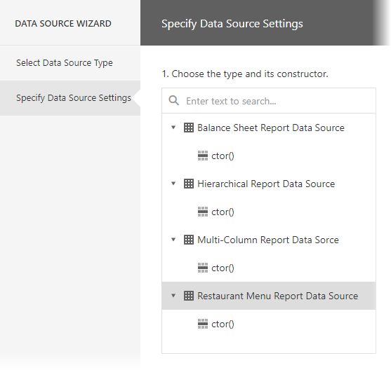
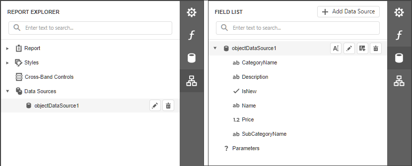

# Bind a Report to Object Data

This topic describes how to bind a report to object data at design time.

## Create a Project and Prepare a Data Source

1. [Create a new report](../../report-designer/add-new-reports.md).

2. Invoke the designer [menu](../report-designer-tools/menu.md) and click **Add Data Source**.
	
    

    This invokes the Data Source Wizard.

3. Choose the **Object** option and click **Next**.
	
    

4. Select an object type and a data member, and configure parameters on the next screen.

    

    * Select an object type and constructor from the list. If you select an object type, the default constructor is invoked.

        

    * Select the method that should provide data. Alternatively, select **Entire Object** to bind to the object's fields.

        

    * Specify input values for the constructor (if you selected a constructor that requires input values). Specify input values for the data member (if you selected a data member that requires input values).

        

        You can use expressions to provide data source parameter values. Click a parameter's marker and select **Expression** from the popup menu to switch the parameter's editor to the expression mode. Specify an expression in the parameter's editor, or click the parameter's ellipsis button to launch the [Expression Editor](xref:114059). You can use [report parameters](xref:4812) in expressions to specify an input value for a data source parameter.

        

    Click **Finish** to close the Data Source Wizard.

After you finish the wizard, it creates an **ObjectDataSource** component. This component retrieves the data fields that the selected object type includes. The [Field List](../report-designer-tools/ui-panels/field-list.md) reflects the data source structure.

## Configure Parameters

Choose an **ObjectDataSource** component in the Field List and click **Edit Parameters**. Reconfigure the parameters in the invoked wizard page.

