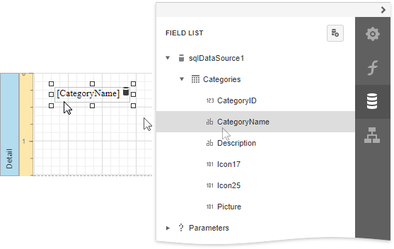
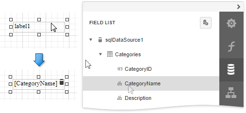
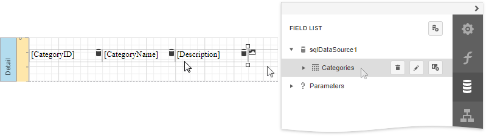
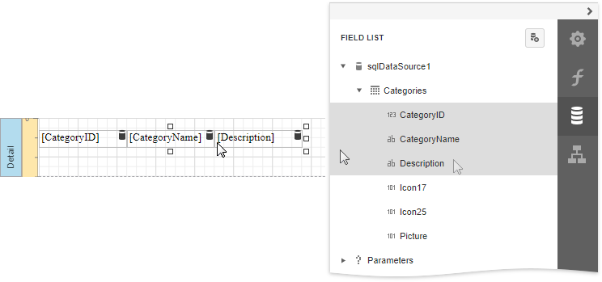
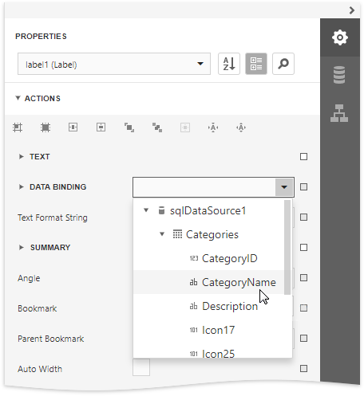

# Bind Report Controls to Data (Data Bindings)

> [!Warning]
> Use the approach below if expression bindings **are not enabled** in the Report Designer (the [Expressions](../report-designer-tools/ui-panels/expressions-panel.md)  panel is not available in the Designer).
>
> See [Bind Report Controls to Data (Expression Bindings)](bind-controls-to-data-expression-bindings.md) if expression bindings **are enabled** in the Report Designer (the [Expressions](../report-designer-tools/ui-panels/expressions-panel.md)  panel is available in the Designer).

You can use the following approaches to include a data source's information in your report:

* [Use the Field List](#use-the-field-list)
* [Use the Properties Panel](#use-the-properties-panel)

## Use the Field List

After you [bind your report to data](../bind-to-data.md), the [Field List](../report-designer-tools/ui-panels/field-list.md) panel displays the data source's hierarchy and provides access to the available data fields. 

Drop a data field from this panel onto a report's surface to create a new report control bound to the corresponding field.

Drop a data field onto an existing control to bind this control to the corresponding field.

You can also drop an entire data table onto a report to create a [Table](../use-report-elements/use-tables.md) control with its cells bound to the corresponding data table fields. 

To select multiple fields in the Field List, hold CTRL or SHIFT and click the fields. Drop these fields onto a report to create a new table.

## Use the Properties Panel

You can use the [Properties](../report-designer-tools/ui-panels/properties-panel.md) panel to bind a report control to a data field. Select the control, expand the **Data Bindings** drop-down list in the **Actions** category and choose a data field.

