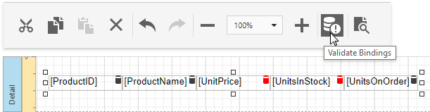

# Validate Report Data Bindings

After you assign a new data source to a loaded report, the report tries to automatically resolve all data bindings. You can check which the field names of your data source do not coincide with the report controls' bindings.

To do this, click the [Main Toolbar](../report-designer-tools/toolbar.md)'s **Validate Bindings** command. Report controls with invalid bindings are marked with the  icon in the [Design surface](../report-designer-tools/design-surface.md).

