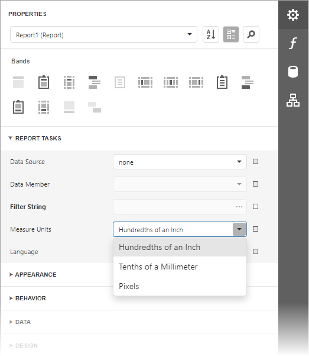

# Change Report Measurement Units

Most metrics of report elements (element locations, dimensions, and margins) can be expressed in units that correspond to one of the following systems of measurement.

* **Imperial system** (hundredths of an inch)
	
	This is the default system for a new report.
* **Metric system** (tenths of a millimeter)
* **Screen coordinates** (pixels)

To assign a system of measurements to a report, use its **Measure Units** property. You can specify this property in the [Properties](../report-designer-tools/ui-panels/properties-panel.md) panel.

When system of measurement changes, the Report Designer recalculates property values, and updates the layout of all report elements. The system of measurement determines the minimum increment with which an element's [location and size](../use-report-elements/manipulate-report-elements/arrange-report-controls.md) can be changed.