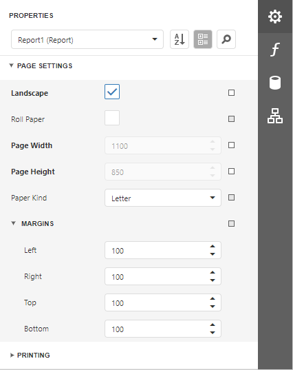
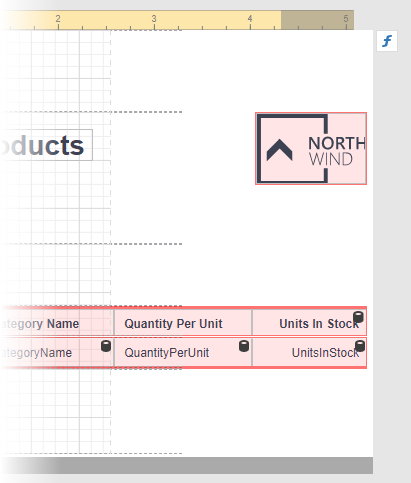

# Change a Report's Page Settings

In the Report Designer, page settings of a report can be specified in one of two ways. The first approach forces the default printer settings to be used when the report is printed, while the other one enables you to alter page settings independently.

## Specify the Report's Page Settings

While designing the report, you can specify the report's page settings in the [Properties](../report-designer-tools/ui-panels/properties-panel.md) panel. Expand the **Page Settings** category to access this options:

You can set the page orientation and modify the margins. The margin values are expressed in the report's [measurement units](change-a-report-measurement-units.md). You can select from the predefined paper sizes (**Paper Kind** property), choose **Custom** and create your own paper size.

These settings affect the layout of the report's design surface. After their modification, you may notice red warning marks, indicating that the controls go beyond the page width.

