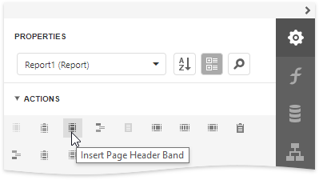
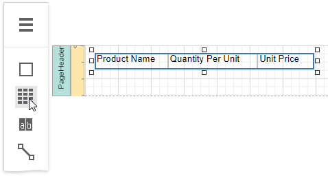
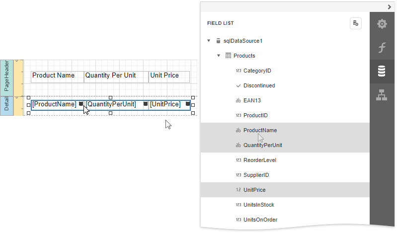
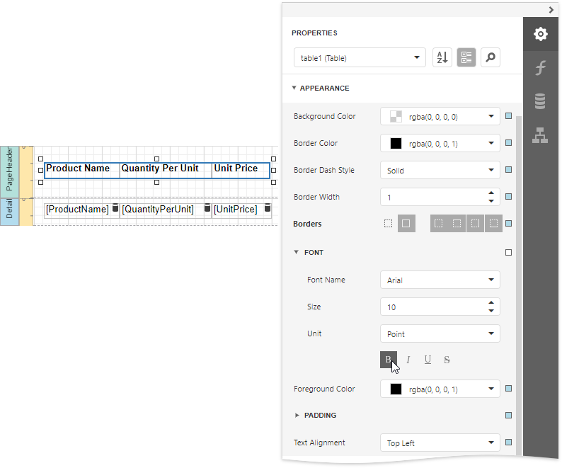
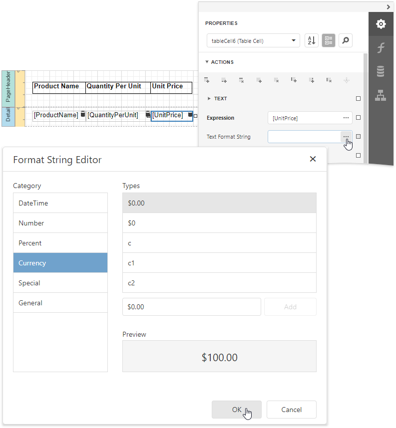
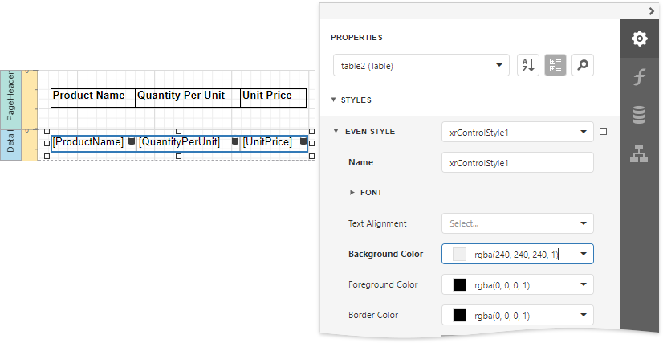

# Create a Table Report

This tutorial describes how to create a data-bound report displaying information in a tabular format. Table reports should not be confused with hierarchical [master-detail reports](create-a-master-detail-report-use-detail-report-bands.md), nor with [cross-tab reports](create-a-cross-tab-report.md).

1. [Create a new report](../add-new-reports.md) or [open an existing one](../open-reports.md).

2. [Bind the report](../bind-to-data.md) to a required data source.

3. Add the [Page Header](../introduction-to-banded-reports.md) band to the report to print the column headers at the top of every document page. To do this, expand the **Actions** category and click **Insert Page Header Band**.

    

4. Drop the [Table](../use-report-elements/use-tables.md) control from the [Toolbox](../report-designer-tools/toolbox.md) onto the Page Header band and specify columns' text to create column headers.

    

5. To provide dynamic content to the report, switch to the [Field List](../report-designer-tools/ui-panels/field-list.md), select data fields and drop them onto the Detail band.

    

    This creates a table with the same number of cells as the number of fields selected with each cell bound to the appropriate data field.

6. Click an empty place on the report's surface and draw a rectangle around the table to select it. 

    

7. Expand the **Appearance** category and specify the **Font**, **Text Alignment** and **Borders** properties to customize the tables' appearance.

    

9. Define a currency format for the **UnitPrice** cell. Select the cell and click the **Text Format String** property's ellipsis button. Select the appropriate format in the invoked **Format String Editor** editor and click **OK**.

    

10. To further improve the table readability, you can apply different visual styles to its odd and even rows. See [Report Visual Styles](../customize-appearance/report-visual-styles.md) to learn more. 

    
	
	See the [Use Tables](../use-report-elements/use-tables.md) section to learn how to add or remove the table's rows and cells, as well as convert the table's cells to separate label controls.

Switch to [Print Preview](../preview-print-and-export-reports.md) to see the resulting report.

