# Create a Vertical Report

This tutorial describes how to use vertical bands to create a **Profit and Loss** report. You can perform similar steps to create various vertical reports depending on your requirements.

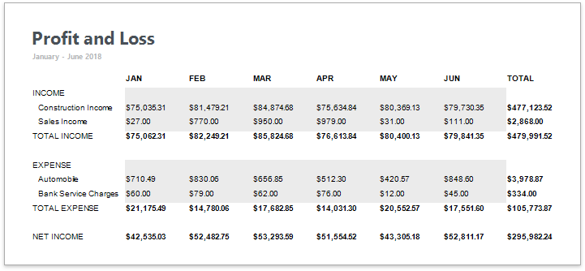

## Add a Vertical Report

1. [Create a new report](../add-new-reports.md) or [open an existing one](../open-reports.md).

2. [Bind the report](../bind-to-data.md) to a required data source.

3. Change the report page layout to landscape so that the vertical table fit the report. Switch to the [Properties](../../report-designer-tools/ui-panels/properties-panel.md) panel, expand the **Page Settings** category and enable the **Landscape** property.

    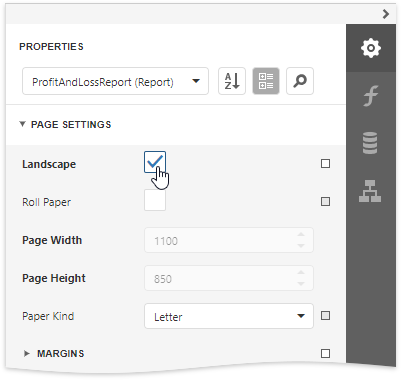

2. Replace the Detail band with the  [Vertical Header, Vertical Detail and Vertical Total](../introduction-to-banded-reports.md#vertical-bands) bands to display record fields vertically. Expand the **Actions** category and click the corresponding commands.

    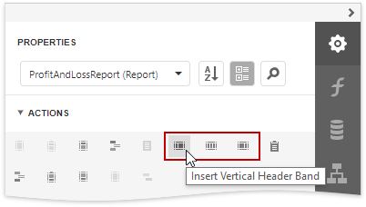

    > [!NOTE]
    > If your report's Detail band contains report controls, this band and all these controls are lost when you add a vertical band (the same behavior takes place in the opposite situation).

## Vertical Header Band

Add a table with a single column that displays headers of the report's data fields.

1. Drop the [Table](../use-report-elements/use-tables.md) control from the [Toolbox](../../report-designer-tools/toolbox.md) onto the Vertical Header band.

    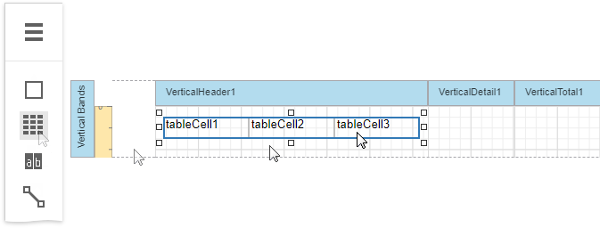

2. [Add extra cells](../use-report-elements/use-tables/manipulate-table-elements.md) to the table's column to display group names for data fields and headers for vertical totals. Specify rows' text and set up the table's appearance.

    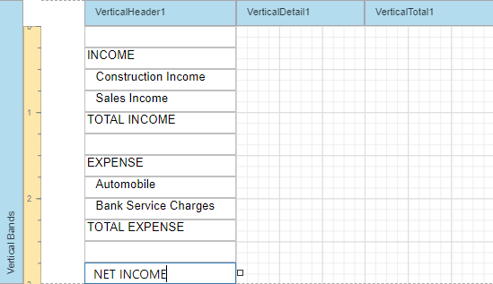

## Vertical Detail Band

Add a table with a single column that is printed so many times as there are records in the report's data source.

1. Drop the **Table** control onto the Vertical Detail band. Add cells corresponding to the extra cells you added in the Vertical Header band.

2. To provide dynamic content to the report, switch to the [Field List](../report-designer-tools/ui-panels/field-list.md) and drop data fields onto the corresponding table cells.

    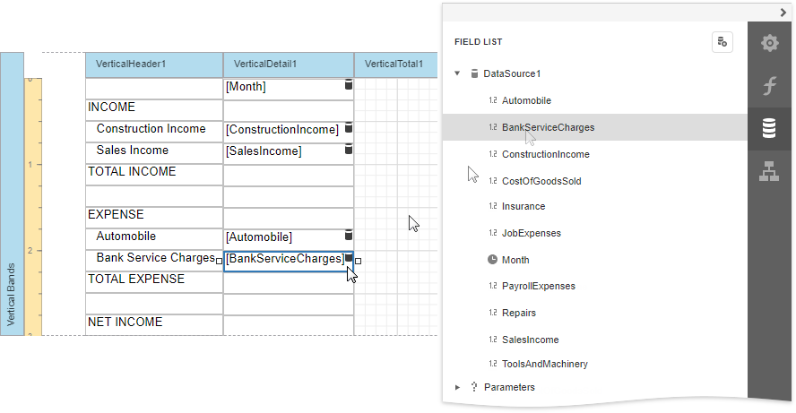

3. Set the **Month** field-bound cell's **Expression** property to _Upper(FormatString('{0:MMM}', [Month]))_.

    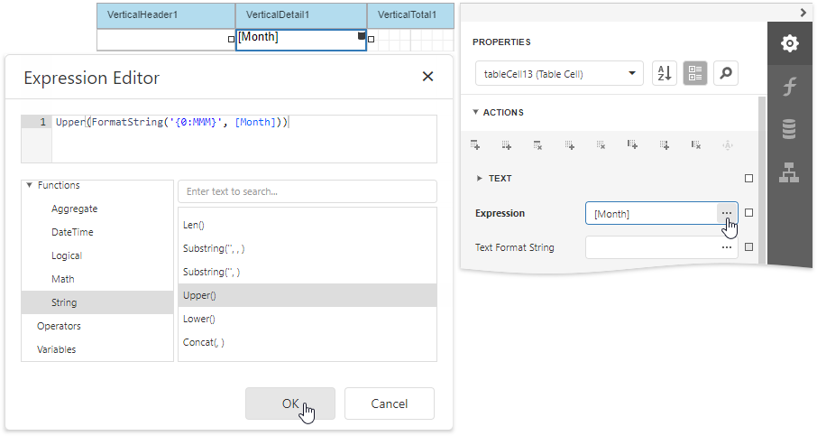

4. Add [calculated fields](../shape-report-data/use-calculated-fields.md) and bind the corresponding cells to them. You can apply different visual styles to cells to improve the table readability.

    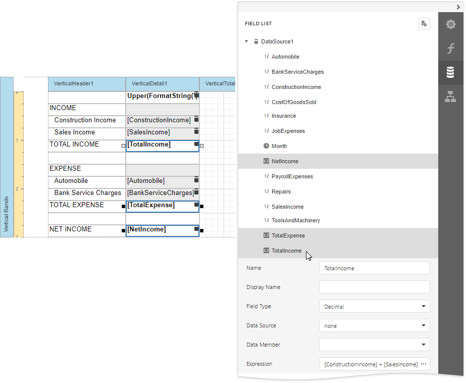

5. Select all the data-bound cells and set their **Text Format String** property to _{0:C2}_ (the default value that the wizard set for decimal fields).

    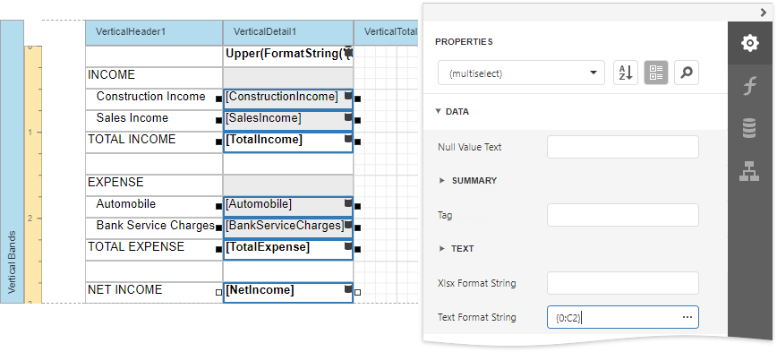

## Vertical Total Band

Add a table with a single column that has so many labels in cells as there are summary functions you specified for each field (only the **sum** function for each field in this tutorial).

1. Drop the **Table** control onto the Vertical Total band. Add cells corresponding to the extra cells you added in the Vertical Header band. Set the first cell's **Text** property to _TOTAL_.

2. Add [Label](../use-report-elements/use-basic-report-controls/label.md) controls to display vertical totals that summarize totals in each group.
 Select a label, expand the **Actions** category, select the **Summary** section and set the **Running** property to **Report**.

    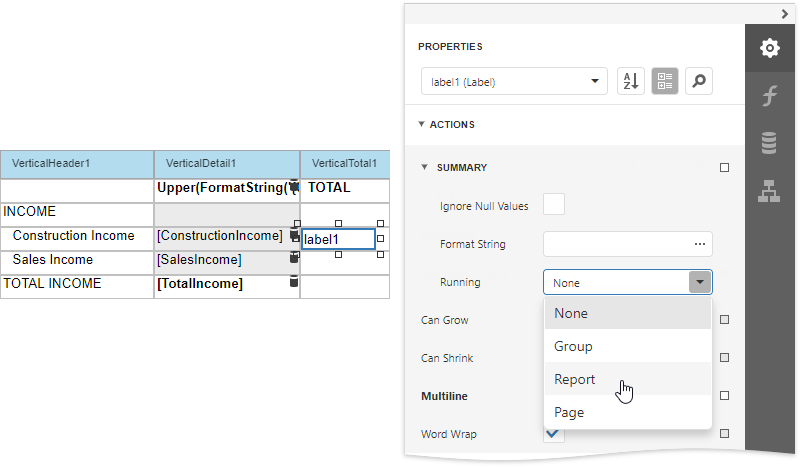

3. Specify the **Expression** and **Text Format String** properties for table cells. Copy and paste a label with a total function so that all totals have the same size and position.
  
    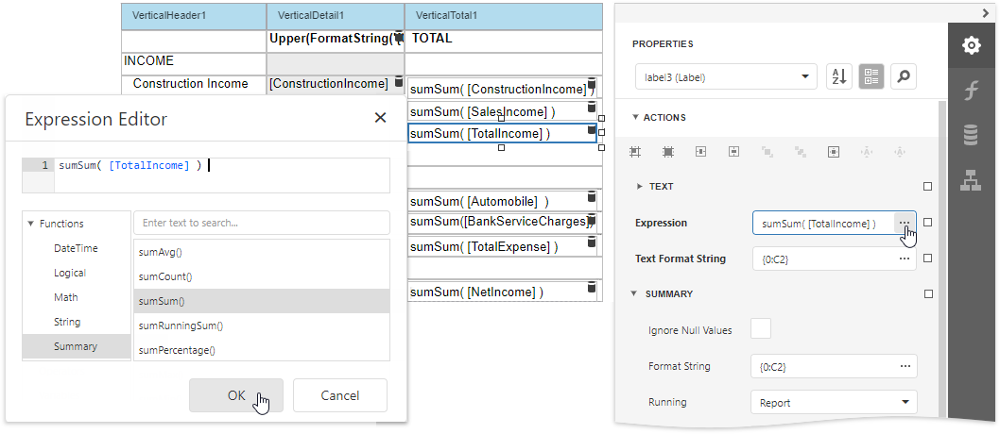

## Preview the Result

Switch to [Print Preview](../preview-print-and-export-reports.md) to see the resulting report.

## Set Vertical Table Options

You can set the following options to modify the vertical table:

* Set the Vertical Header band's **Repeat Every Page** property to false to display field headers once - on the first report page.

    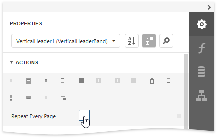

* Set the Vertical Detail band's **Band Layout** property to **Across Then Down** to print the data records that do not fit a page on the same page, otherwise, they are printed on the next page.

    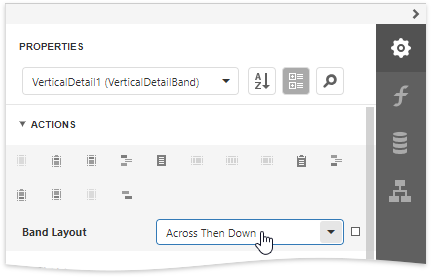