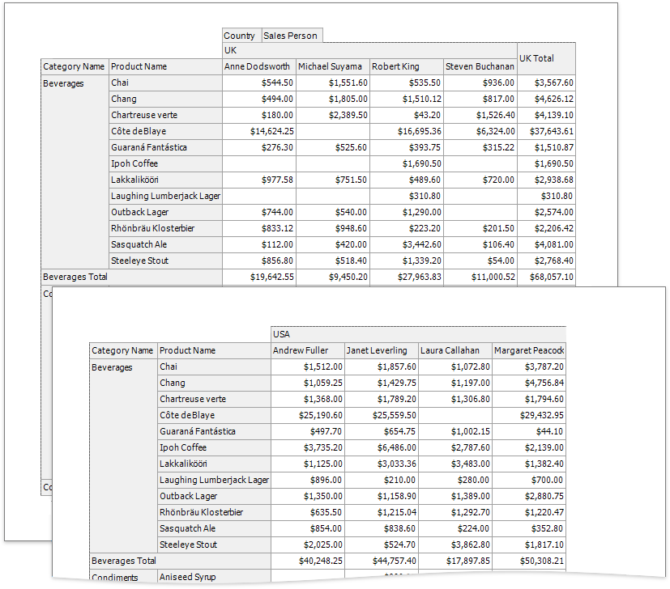
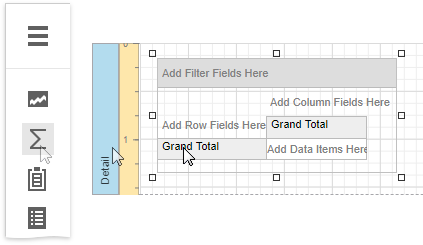
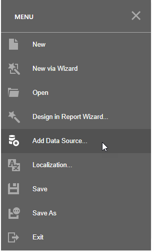
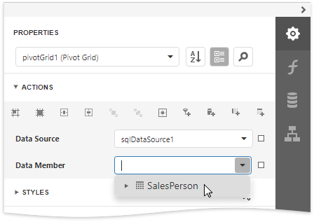
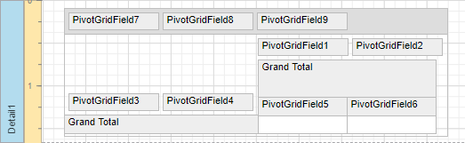
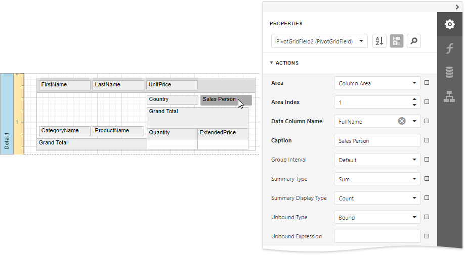
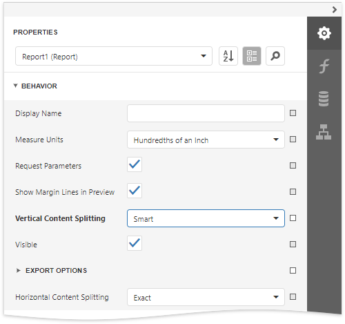
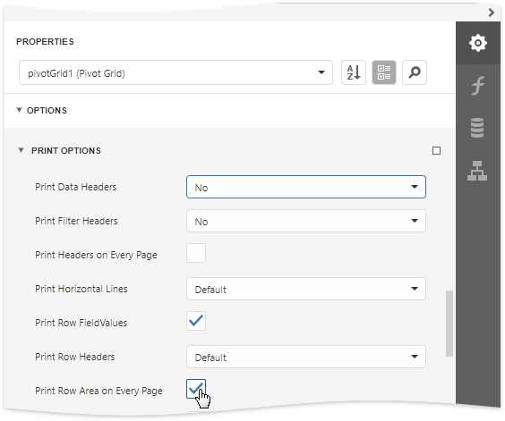

# Cross-Tab Reports

A cross-tab report displays complex multi-dimensional data, such as summary statistics, surveys, and market research information. This report uses a Pivot Grid control that calculates automatic summaries and grand totals across grouped rows and columns.

## Add a Pivot Grid and Bind It to Data

1. [Create a new report](../add-new-reports.md) or [open an existing one](../open-reports.md).

2. Drop the **Pivot Grid** control from the [Toolbox](../report-designer-tools/toolbox.md) onto the [Detail band](../introduction-to-banded-reports.md).

    

    You cannot place a Pivot Grid in another report control (for example, [Table Cell](../use-report-elements/use-tables.md) or [Panel](../use-report-elements/use-basic-report-controls/panel.md)) because its width cannot be determined at design time.

3. Invoke the designer [menu](../report-designer-tools/menu.md) and click **Add Data Source...**.

   
   
   Navigate through the invoked [Data Source Wizard](../report-designer-tools/data-source-wizard.md)'s pages to set up the data source. See the [Bind to Data](../bind-to-data.md) section for more information. 

3. After the data source is created, you can specify the Pivot Grid's **Data Source** and **Data Member** properties. Expand the **Actions** category and to bind the Pivot Grid to data.

    

    > [!NOTE]
    > Ensure that a report's **Data Source** property is not set if you place the Pivot Grid in the Detail band. Otherwise, the Pivot Grid data is printed as many times as there are rows in the report data source.

## Define the Pivot Grid's Content

1. To add a field to the particular grid area, expand the **Actions** category and click one of the following buttons.

    | Icon | Description |
    |---|---|
    |  | Adds a field to the **Filter Header** area. This field is available for further customizations. |
    |  | Adds a field to the **Data Header** area. The summaries will be calculated for all the cells, each cell is identified by a specific column and row. |
    |  | Adds a field to the **Column Header** area. This field's values will represent column headers. |
    |  | Adds a field to the **Row Header** area. This field's values will represent row headers.|

    Use these buttons to define the Pivot Grid's layout.

    

2. To adjust a Pivot Grid field, select the required grid field on the design surface, switch to the **Properties panel** and expand the **Actions** category. Specify the **Data Column Name** property to bind a grid field to a data source field.

    

    You can also specify the field position, using the **Area** property or change the order of fields within their area, specifying the **Area Index** property. If required, it is possible to customize many other properties for the Pivot Grid and its fields.

## Adjust the Pivot Grid's Layout

Set the report's **Vertical Content Splitting** property to **Smart** to split the Pivot Grid along the column borders if it does not fit the report's page in Print Preview.

## Specify the Pivot Grid's Print Options
Use the **Options** category's **Print Options** section to specify print options and define which Pivot Grid elements are printed.

* Set the **Print Data Headers** property to **No** to prevent data fields' headers from being printed.

* Enable the **Print Row Area On Every Page** property to repeat row headers on each document page when the Pivot Grid's layout is divided horizontally across several pages.

Switch to [Print Preview](../preview-print-and-export-reports.md) to see the resulting report.
