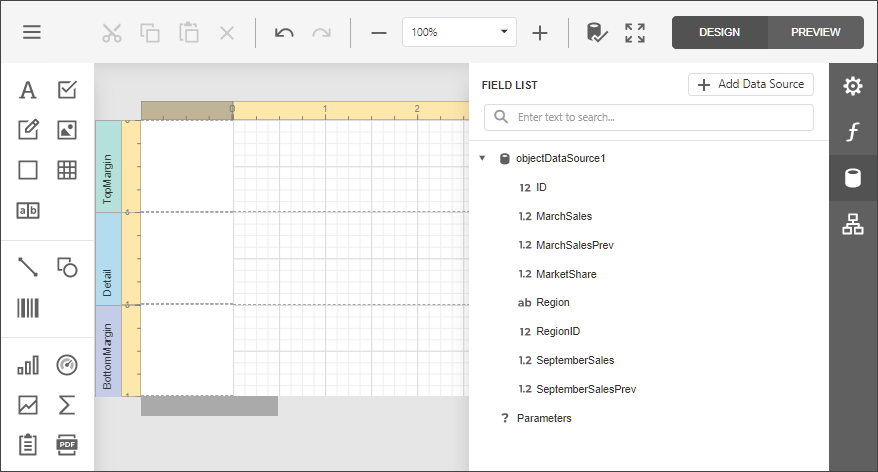
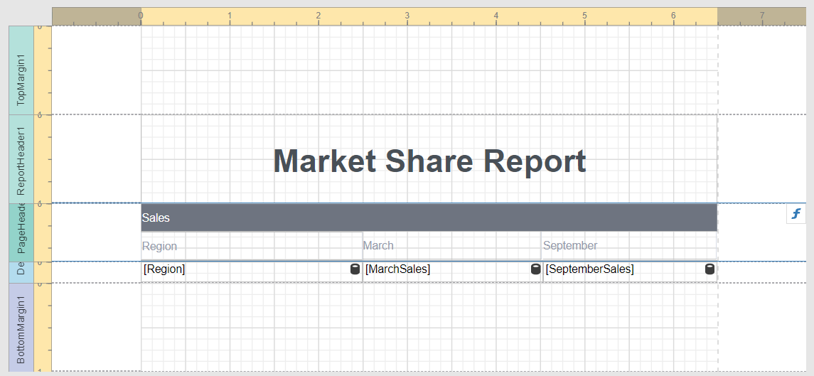
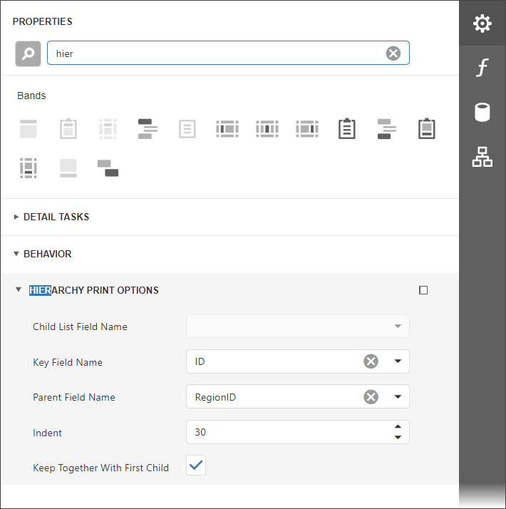
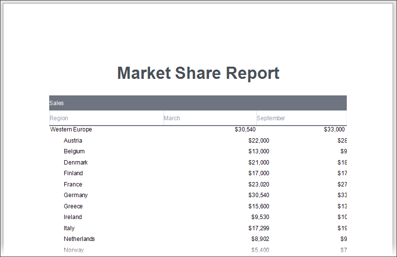
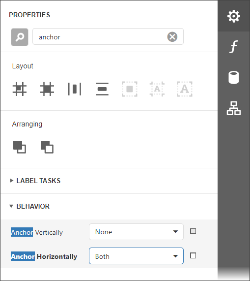
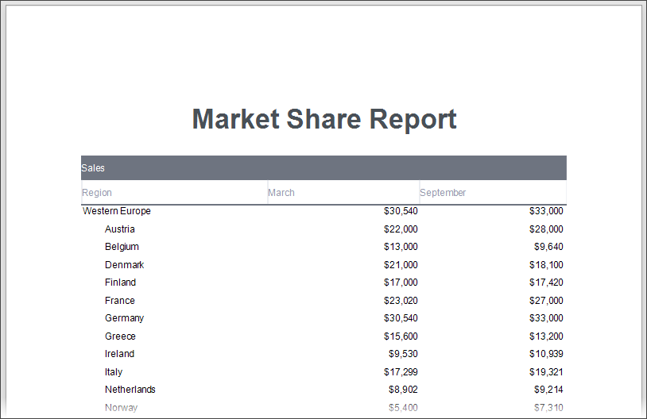
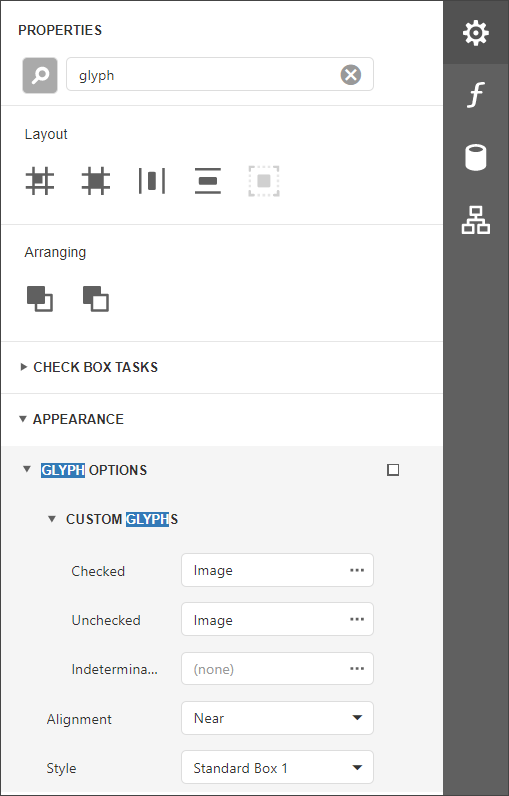
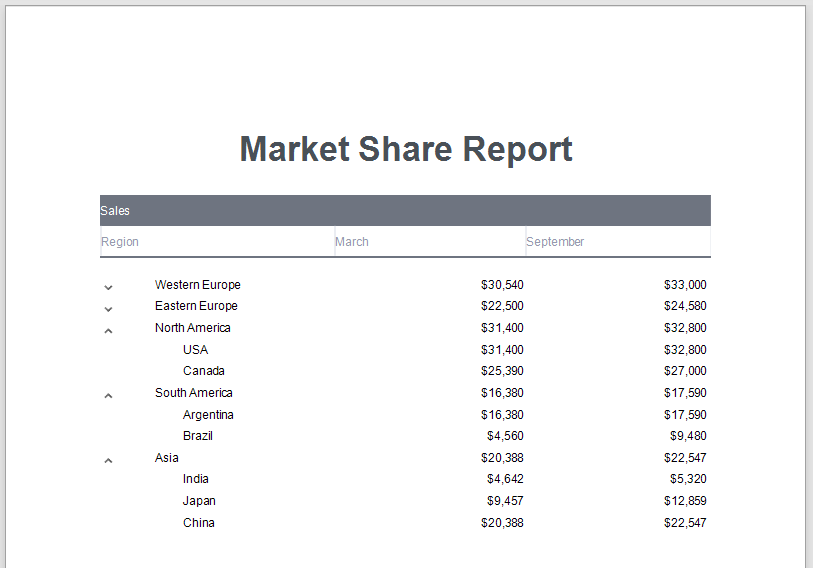
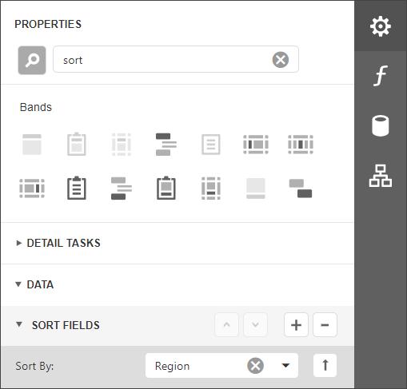
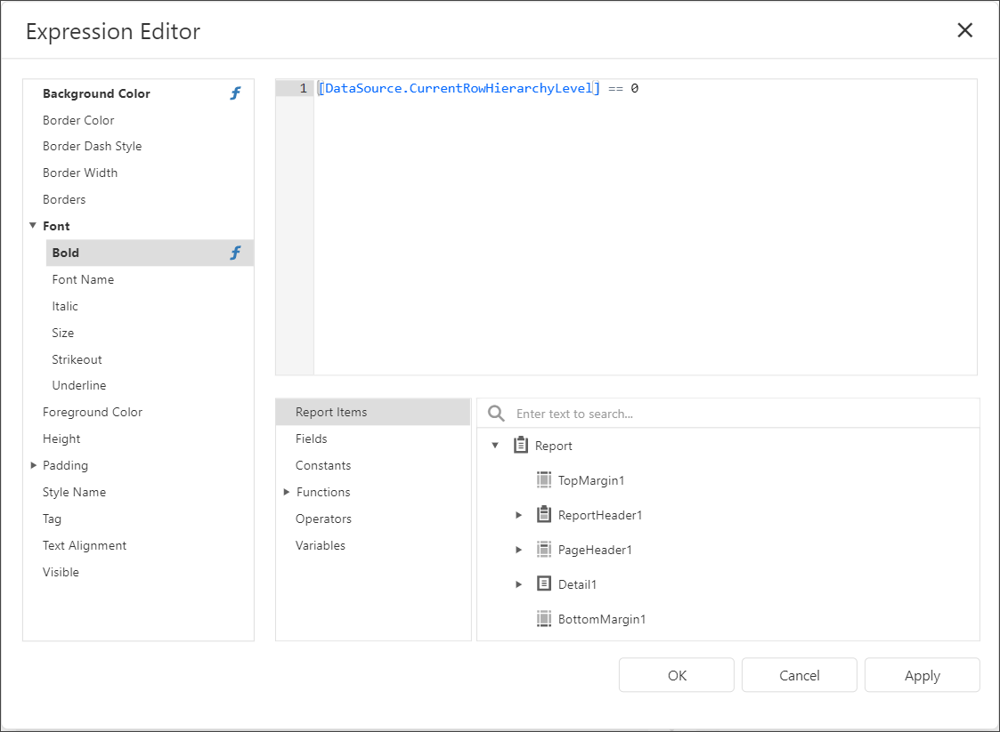

# Hierarchical Reports

This tutorial describes how to use the [detail band](../../report-designer/introduction-to-banded-reports.md)'s **Hierarchy Print Options** property to create a hierarchical report.


1. [Create a new report](../add-new-reports.md) or [open an existing one](../open-reports.md).

1. [Bind the report](../bind-to-data.md) to a data source.

    

    Each record in the data source should include a field that defines the parent-child relationship and thus builds the hierarchy.

1. Arrange controls on the report.

    - Add the [Report Header](../introduction-to-banded-reports.md) and [Page Header](../introduction-to-banded-reports.md) bands (see the **Manage Report Bands | Add Bands** section in the [Introduction to Banded Reports](../introduction-to-banded-reports.md) document for details).

    - Add [data-bound labels](../use-report-elements/use-basic-report-controls/label.md) to the **Detail** band.

    

    Switch to [PREVIEW](../preview-print-and-export-reports.md) to see an intermediate result.

    

1. Switch back to **DESIGN**, select the **Detail** band, and type in "hier" in the **Search field** to navigate to the **Hierarchy Print Options** property pane.

    

    Set the following options:

    - **Key Field Name** and **Parent Field Name**, or **Child List Field Name**  
    Set the **Key Field Name** and **Parent Field Name** properties if your report's data has the Id-ParentID related fields.  
    Set the **Child List Field Name** property if your report's data is recursive. Assign the collection of child objects (records) if they have the same type as the parent objects (records).

    - **Indent**  
    Specify the child level node offset.

    - **Keep Together with First Child**  
    Specify whether to print a parent node together with its first child node on the next page if these nodes do not fit at the end of a page.

1. Preview the result.

    

    As you can see in the image above, the **Detail** band that contains child rows is printed with the specified indent. However, the row (the sum of the label widths) does not fit the page now.

1. Align labels.

    - Anchor the first data-bound label to the Detail band's left and right edges. Set the label's **Anchor Horizontally** property to **Both**.

        

    - Anchor the rest of the data-bound labels to the right edge of the Detail band (their container). Set their **Anchor Horizontal** property to **Right**.

        

1. Preview the result.

    

1. Add a **drill-down control** to expand/collapse child rows.
    - Add a [Check Box](../use-report-elements/use-basic-report-controls/check-box.md) control to the **Detail** band at the left-most position.

      

    - Set the **Check Box** control's glyph options and remove the unnecessary "checkBox1" text. You can specify different images to indicate the checkbox state. In the **Custom Glyphs** section, specify the  image for the **Checked** state, and the  image for the **Unchecked** state.

        

    - Set the **Detail** band's **Drill Down Control** property to the added **Check Box** control.

        

    - Click the **f-button** next to the **Check Box** control to invoke the **Expression Editor**, and assign the following expression to the **Check State** property:
        ```
        Iif( [ReportItems.Detail1.DrillDownExpanded],  'Checked', 'Unchecked')
        ```

        

    - Preview the result:

         

1. Sort report data.

    Use the Detail band's **Sort Fields** property to sort data.

    
    
    Preview the result:

    

1. Highlight root nodes.

    To format rows based on their nesting level, use the `CurrentRowHierarchyLevel` variable in expressions. Specify the following expressions for the **Detail** band's appearance properties:

    **Background Color**:
    ```
    Iif([DataSource.CurrentRowHierarchyLevel] == 0, Rgb(231,235,244), ?)
    ```
    **Font | Bold**:
    ```
    [DataSource.CurrentRowHierarchyLevel] == 0
    ```

    

    Preview the result:

    
