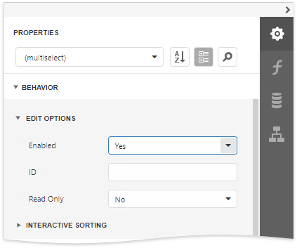

# Interactive E-Forms

This tutorial describes how to create an electronic form and make it fillable directly in Print Preview before printing or exporting it.

To get started with this tutorial, [create a new report](../add-new-reports.md) or [open an existing one](../open-reports.md).

## Add Form Fields

Add the [Label](../use-report-elements/use-basic-report-controls/label.md) controls to the report and arrange them according to the form's template. Set the labels' **Text** property to the form's field names.

## Add Fillable Cells

Use the [Character Comb](../use-report-elements/use-basic-report-controls/character-comb.md) control for the form's text fields. This control displays letters in individual cells and allows end users to fill these cells in Print Preview.

1. Drop the **Character Comb** item from the Toolbox onto the report.
	
	

2.  Select all the added controls, clear their text, switch to the [Properties](../report-designer-tools/ui-panels/properties-panel.md) panel and expand the **Layout** category. Adjust cell settings, such as **Cell Width**, **Cell Height**, **Cell Horizontal Spacing**, etc.
	
	

3. Expand the **Behavior** category, select the **Edit Options** section and set the controls' **Enabled** property to **Yes** to enable content editing in Print Preview.
	
	

## Add Check Box Editors

1. Add two [Check Box](../use-report-elements/use-basic-report-controls/check-box.md) controls to the report for selecting a gender (_Male/Female_ fields). Then, change their text and appearance settings.

    

2. To enable switching check box states in Print Preview, expand the **Behavior** category, select the **Edit Options** section and set the **Enabled** property to **Yes** as you did before. To allow selecting only one option at a time, combine these check boxes into a logical group by specifying the same value for the **Group ID** property.

    

## Add the Signature Editor

1. Add the [Picture Box](../use-report-elements/use-basic-report-controls/picture-box.md) control for the form's _Signature_ field. 
    
    
     
2. Switch to the [Properties](../report-designer-tools/ui-panels/properties-panel.md) panel and adjust control's appearance settings. Expand the **Behavior** category and select the **Edit Options** section. Set the **Enabled** property to **Yes** and the **Editor Name** property to signature to enable drawing in Print Preview.

    

## Get the Result
The e-form report is now ready. Switch to [Print Preview](../preview-print-and-export-reports.md) to see the result.

To highlight all editing fields available in the form, click the  **Highlight Editing Fields** button on the Print Preview toolbar. Clicking a field invokes the appropriate editor.

