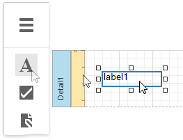
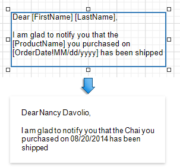

# Letters

This tutorial describes the steps to create a mail merge report, in which data fields are embedded into a label's text that is replaced with corresponding data values on preview or export.

1. [Create a new report](../add-new-reports.md) or [open an existing one](../open-reports.md).

2. [Bind the report](../bind-to-data.md) to a required data source.

3. Drop the [Label](../use-report-elements/use-basic-report-controls/label.md) control from the [Toolbox](../report-designer-tools/toolbox.md) onto the [Detail](../introduction-to-banded-reports.md) band.

    

4. Add the required text to the control and embed data fields' names into it, surrounded by **[** square brackets **]**, as shown in the following image:

    

For more information about mail merge, refer to [Use Embedded Fields (Mail Merge)](../use-report-elements/use-embedded-fields-mail-merge.md).

