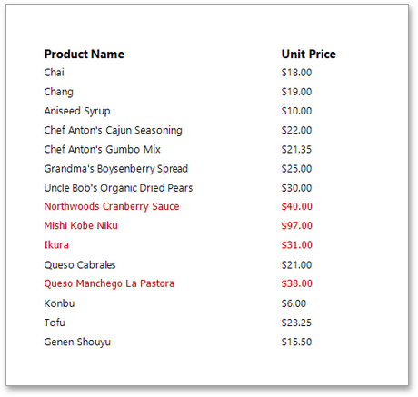

This document describes the steps needed to conditionally change a control's appearance (e.g., make a Label's text red if its value exceeds a certain threshold). Thanks to the _formatting rules_ feature, no [scripts](../../../../../interface-elements-for-web/articles/report-designer/creating-reports/scripting.md) are required to achieve this, so you shouldn't write any code.

To conditionally change a control's appearance, do the following.
1. [Create a new report](../../../../../interface-elements-for-web/articles/report-designer/creating-reports/basic-operations/create-a-new-report.md) and [bind it to a data source](../../../../../interface-elements-for-web/articles/report-designer/creating-reports/providing-data/bind-a-report-to-data.md).
2. Switch to the [Properties Panel](../../../../../interface-elements-for-web/articles/report-designer/interface-elements/properties-panel.md), expand the **Appearance** category and then expand the **Formatting Rules** section. Add a new _formatting rule_ by clicking the  button.
	
	
3. Expand the newly added rule, specify its name and formatting options (e.g., **Foreground Color**). You can also specify the **Data Source** and **Data Member** properties. These properties define the list containing data fields that can participate in constructing the Boolean condition.
	
	
4. Then, click the ellipsis button for the **Condition** property. In the invoked [Expression Editor](../../../../../interface-elements-for-web/articles/report-designer/interface-elements/expression-editor.md), define the required Boolean condition (which means that its result is returned as either true or false). In this tutorial, we will format fields if the **UnitPrice** value is greater than **30**.
	
	
	
	To save the condition and close the dialog, click **Save**.
5. A formatting rule can be applied to any number of [report elements](../../../../../interface-elements-for-web/articles/report-designer/report-elements.md) within the same report. To apply a rule to a control, select the required report control and enable the checkbox for the required rule.
	
	
	
	If multiple rules are applied, it is possible to customize their precedence by using the  and  buttons. So the rules are applied in the same order that they appear in the list, and the last rule in the list has the highest priority.

Switch your report to the [Preview](../../../../../interface-elements-for-web/articles/report-designer/document-preview.md) mode and view the result.

