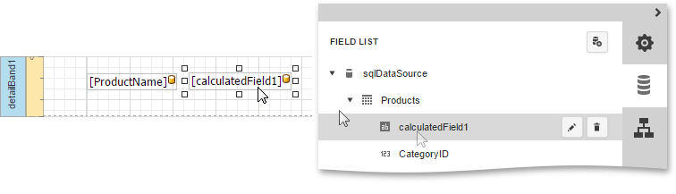
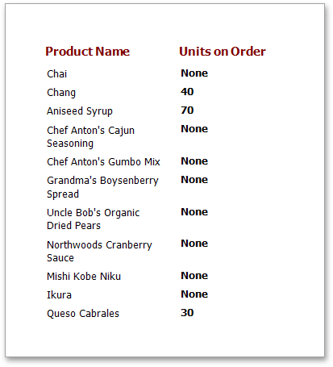

In this tutorial, you will learn how to change a label's text if a certain condition is met, without using [scripts](../../../../../interface-elements-for-web/articles/report-designer/creating-reports/scripting.md).

To conditionally change a label's text, do the following.
1. [Create a new report](../../../../../interface-elements-for-web/articles/report-designer/creating-reports/basic-operations/create-a-new-report.md) and [bind it to a data source](../../../../../interface-elements-for-web/articles/report-designer/creating-reports/providing-data/bind-a-report-to-data.md).
2. Now, add a new [calculated field](../../../../../interface-elements-for-web/articles/report-designer/creating-reports/providing-data/calculated-fields.md). To do this, switch to the [Field List](../../../../../interface-elements-for-web/articles/report-designer/interface-elements/field-list.md) panel, click a data table and click **Add calculated field** button.
	
	
3. Click the **Edit** button (the 'pencil' icon ) for the calculated field and set the **Field Type** property to **String**.
	
	Then, click the ellipsis button for its **Expression** property and in the invoked [Expression Editor](../../../../../interface-elements-for-web/articles/report-designer/interface-elements/expression-editor.md), define the required logical condition for the calculated field (e.g., **Iif([UnitsOnOrder] == 0, 'None', [UnitsOnOrder])**, which means that if the **UnitsOnOrder** data field's value is equal to **0**, the control's text will be replaced with **None**).
	
	
4. Finally, drop the required data fields (and the created calculated field as well) from the Field List onto the report's [Detail](../../../../../interface-elements-for-web/articles/report-designer/report-elements/report-bands.md) band.
	
	

The report is now ready. Switch your report to the [Preview](../../../../../interface-elements-for-web/articles/report-designer/document-preview.md) mode and view the result.

