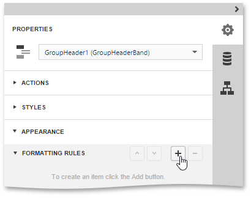
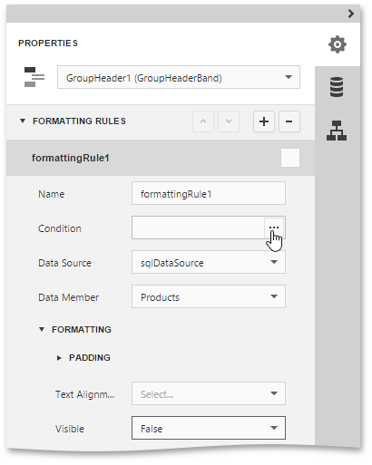
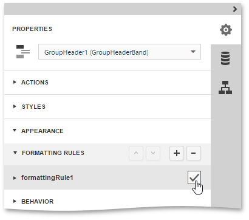
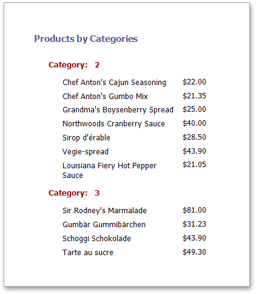

# Conditionally Hide Bands
This document provides the sample, illustrating how to hide bands if a certain logical condition is met. Note that no [scripts](../../../../../interface-elements-for-web/articles/report-designer/creating-reports/scripting.md) are required to accomplish this task.

To demonstrate this feature, use a report with grouping, similar to the one created in the following tutorial: [Grouping Data](../../../../../interface-elements-for-web/articles/report-designer/creating-reports/shaping-data/grouping-data.md).

To conditionally hide bands in a report, do the following.
1. Select the [Group Header](../../../../../interface-elements-for-web/articles/report-designer/report-elements/report-bands.md) band and in the [Properties Panel](../../../../../interface-elements-for-web/articles/report-designer/interface-elements/properties-panel.md), expand the **Appearance** category. Then, expand the **Formatting Rules** section and add a new formatting rule.
	
	
2. Expand the newly created rule and set the **Visible** property to **False**. Click the ellipsis button for the rule's **Condition** property to specify the logical condition, which will define band visibility.
	
	
3. In the invoked [Expression Editor](../../../../../interface-elements-for-web/articles/report-designer/interface-elements/expression-editor.md), construct the required logical expression (e.g., **[CategoryID] &lt; 2**) and click **Save**.
	
	
4. Apply the formatting rule to the Group Header band by enabling the checkbox for this rule.
	
	
	
	Then, apply the same formatting rule to the report's Detail band.

Switch your report to the [Preview](../../../../../interface-elements-for-web/articles/report-designer/document-preview.md) mode and view the result.

