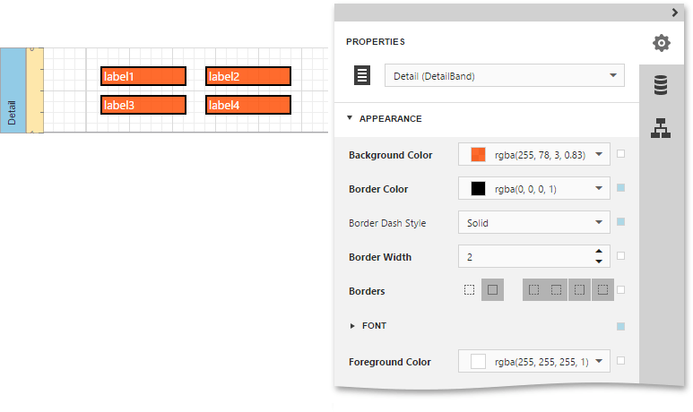
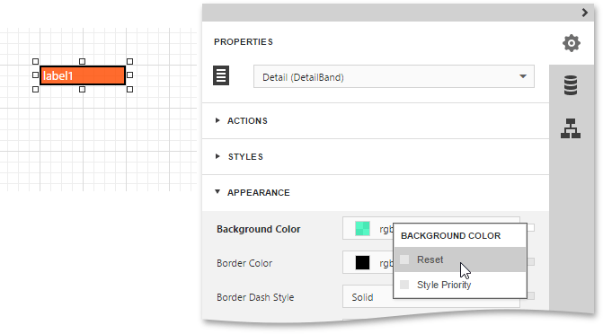
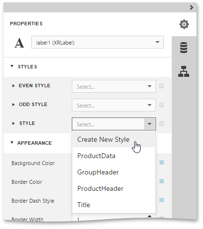
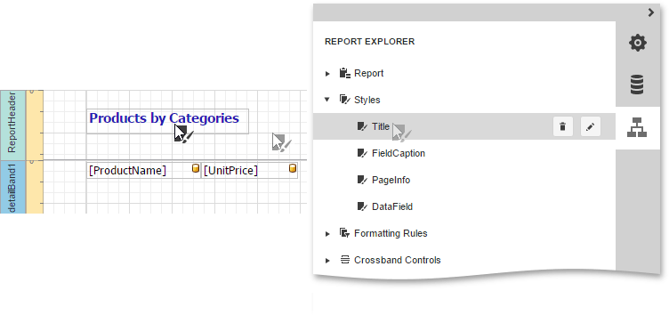
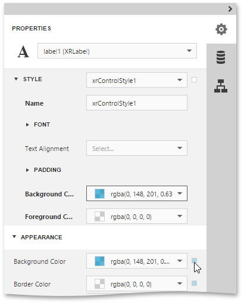
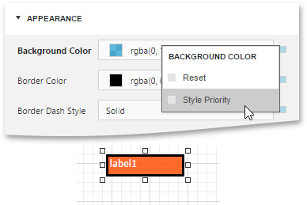
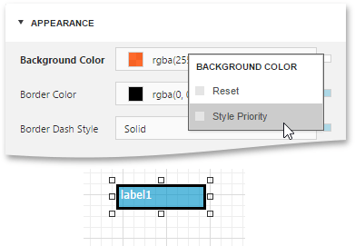

# Understanding Style Concepts
This document describes how you can provide a professional look to your reports, by effectively adjusting the appearance of its elements.

This document consists of the following sections.
* [The Appearance Properties](#properties)
* [Styles Priority and Inheritance](#inheritance)

## <a name="properties"/>The Appearance Properties
In the [Web Report Designer](../../../report-designer.md), a report and each of its elements ([bands](../../report-elements/report-bands.md) and [controls](../../report-elements/report-controls.md)) has a complete set of appearance options (such as **Background Color**, **Borders**, **Font**, **Foreground Color**, **Text Alignment**, etc.). By default, these properties aren't specified, meaning that their real values are obtained from a control's (or band's) _parent_, which is the report itself. So, the appearance specified for a report is distributed to all its child elements. Similarly, the appearance of a band is translated to the controls it contains.

In turn, a control's appearance can be adjusted independently from its parent.

When it is required to reset a value assigned to a control's appearance property in the [Properties Panel](../../interface-elements/properties-panel.md), click the Advanced Options button for this property and then click **Reset**. The control will be restored to the appearance of its parent.

## <a name="inheritance"/>Styles Priority and Inheritance
In addition to the capability to specify [appearance property](#properties) values for every control and band, you can create comprehensive _styles_, and they can be assigned to individual elements.

To assign a particular style to a control, select this control and in the [Properties Panel](../../interface-elements/properties-panel.md), expand the **Styles** category. Then, invoke the drop-down list for the **Style** property and click **Create New Style** or select an existing style.

> [!NOTE]
> A style that is assigned to a band applies to controls that the band contains.

To access the style collection, you can also use the [Report Explorer](../../interface-elements/report-explorer.md), which allows you to add, edit or delete a style.

To apply a style or formatting rule to a report control, drag it from the Report Explorer onto the required report control.

When both styles and individual appearance settings are assigned to an element, the priority is required to decide which of the properties to use.

By default, a style's appearance property has a higher priority than an element's appearance property. The Advanced Options button for this appearance property is highlighted in blue.

To assign a higher priority to an element's appearance property, click the Advanced Options button and then click **Style Priority**. It highlights the Advanced Options button in white.

To revert a higher priority to a style's appearance property, click the Advanced Options button and then, click **Style Priority**.

The same principles are applied to the _odd-even styles_ feature, which allows you to alternate the appearance of consecutive data rows in your report. For details on this, refer to [Use Odd and Even Styles](use-odd-and-even-styles.md).

> [!NOTE]
> When [conditional formatting](conditionally-change-a-controls-appearance.md) is applied to an element, its appearance definition has the highest priority.