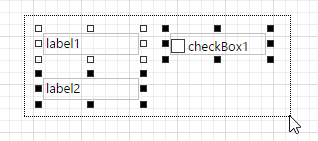
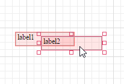
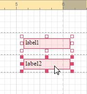
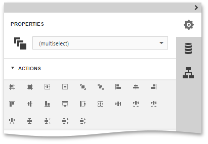
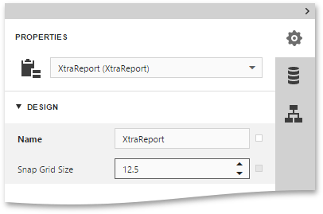
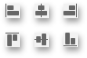

# Adjust the Layout of Report Elements
This document describes how to customize the layout of a [report element](../../report-elements.md) after it is [created](create-report-elements.md). To move and resize an element or align it within the current report, perform one the following actions.
* [Select Report Elements](#select)
* [Move and Resize Report Elements](#move)
* [Align and Position Report Elements](#align)

## <a name="select"/>Select Report Elements
To select a [report control](../../report-elements/report-controls.md) or a [band](../../report-elements/report-bands.md), click it.

For multiple controls selection, click report controls while holding the **CTRL** key down.

Alternatively, click on a blank space and drag the mouse to create a selection frame. When the mouse button is released, all controls within the selection frame's boundaries will be selected. In this case, the previous selection is cleared.

## <a name="move"/>Move and Resize Report Elements
To move a report control, select it, and drag the control to the new location. To move it using the keyboard, press the arrow keys.

To resize a control using the mouse, select it, and then drag a rectangle drawn on its edge or corner.

You can also move and resize multiple selected report controls in the same way as individual controls.

To resize a report band, drag its bottom border.

After moving and resizing report elements, you may notice red warning marks, indicating that the controls overlap or go beyond the page margins.

 

## <a name="align"/>Align and Position Report Elements
The [Web Report Designer](../../../report-designer.md) allows you to establish the distance between report elements and precisely align them to each other. To align the selected control or multiple selected controls, switch to the [Properties Panel](../../interface-elements/properties-panel.md), expand the **Actions** category, and click an appropriate button.

To quickly align and resize a control to the report's **Snap Grid**, click the following buttons.

| Button | Description |
|---|---|
|  | Aligns a control to the Snap Grid. |
|  | Resizes a control to the Snap Grid. |

You can also adjust the **Snap Grid Size**, which is measured in the [measurement units](change-measurement-units-of-a-report.md) set for your report.

To center the selected controls within a band, use the following buttons.

| Button | Description |
|---|---|
|  | Horizontally centers a control within a band. |
|  | Vertically centers a control within a band. |

To position and align the multiple report controls to each other, [select](#select) the primary control that is taken as a sample, then select the control(s) to be adjusted and click one of the following buttons.

| Buttons | Description |
|---|---|
|  | Specify the horizontal (Left, Center or Right) and vertical (Top, Middle or Bottom) control alignment. |
|  | Make the selected controls have the same size. |
|  | Make equal horizontal and vertical spaces between the selected controls. |
|  | Increase horizontal and vertical spacing between the selected controls. |
|  | Decrease horizontal and vertical spacing between the selected controls. |
|  | Remove all horizontal and vertical spacing between the selected controls. |

In addition, to copy, paste and delete controls simultaneously, you can place them within the [Panel](../../report-elements/report-controls.md).