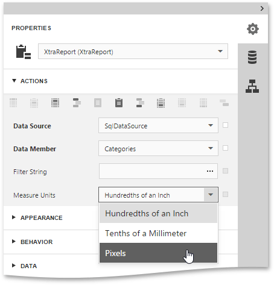

# Change Measurement Units of a Report
For your report, you can choose its global **Measure Units**, which can be set to **Hundredths of an Inch**, **Tenths of a Millimeter**, or to **Pixels**.

To specify the **Measure Units** property, switch to the [Properties Panel](../../../../../interface-elements-for-web/articles/report-designer/interface-elements/properties-panel.md) and select the report in the **Report Controls** drop-down list. Then, expand the **Actions** or **Behavior** category and set this property to the required value.

This defines the basic measurement unit for all the unit-related options of a report and its [bands](../../../../../interface-elements-for-web/articles/report-designer/report-elements/report-bands.md) and [controls](../../../../../interface-elements-for-web/articles/report-designer/report-elements/report-controls.md) (such as _location_, _size_, _border width_, etc.). And this determines the measurement unit of the report's [Snap Grid](../../../../../interface-elements-for-web/articles/report-designer/creating-reports/basic-operations/adjust-the-layout-of-report-elements.md).