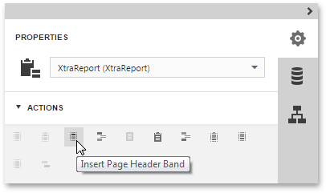

This topic describes how to add [report controls](../../../../../interface-elements-for-web/articles/report-designer/report-elements/report-controls.md) and [bands](../../../../../interface-elements-for-web/articles/report-designer/report-elements/report-bands.md) to a report using the [Web Report Designer](../../../../../interface-elements-for-web/articles/report-designer.md).

This document consists of the following sections.
* [Create Report Controls](#control)
* [Create Report Bands](#band)

## <a name="control"/>Create Report Controls
All available report controls are listed in the [Toolbox](../../../../../interface-elements-for-web/articles/report-designer/interface-elements/toolbox.md). To add a control to the currently opened report, drag and drop it onto an appropriate [report band](../../../../../interface-elements-for-web/articles/report-designer/report-elements/report-bands.md).

Report controls of appropriate types are created automatically, after you drag items from the [Field List](../../../../../interface-elements-for-web/articles/report-designer/interface-elements/field-list.md) and drop them onto the [report surface](../../../../../interface-elements-for-web/articles/report-designer/interface-elements/design-surface.md).

## <a name="band"/>Create Report Bands
To add a new [band](../../../../../interface-elements-for-web/articles/report-designer/report-elements/report-bands.md) of a particular type, switch to the [Properties Panel](../../../../../interface-elements-for-web/articles/report-designer/interface-elements/properties-panel.md), select the report or an existing band in the Report Controls drop-down list. Then, expand the **Actions** category and click one the available buttons.

| Button | Description |
|---|---|
|  | Inserts a Top Margin band. |
|  | Inserts a Report Header band. |
|  | Inserts a Page Header band. |
|  | Inserts a Group Header band. |
|  | Inserts a Detail band. |
|  | Inserts a Detail Report band. |
|  | Inserts a Group Footer band. |
|  | Inserts a Page Footer band. |
|  | Inserts a Report Footer band. |
|  | Inserts a Bottom Margin band. |
|  | Inserts a Sub-Band. Select an existing band to enable this button. |

After creating a report element, you can bind it to data, customize element layout and appearance. For more information, see the following topics.
* [Bind Report Controls to Data](../../../../../interface-elements-for-web/articles/report-designer/creating-reports/providing-data/bind-report-controls-to-data.md)
* [Adjust the Layout of Report Elements](../../../../../interface-elements-for-web/articles/report-designer/creating-reports/basic-operations/adjust-the-layout-of-report-elements.md)
* [Appearance Customization](../../../../../interface-elements-for-web/articles/report-designer/creating-reports/appearance-customization.md)