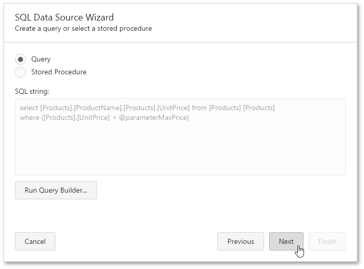

# Query Parameters
A query parameter holds an external value that is inserted into an SQL statement before query execution. This value can be either static or dynamically generated by an associated expression.

In the [Web Report Designer](../../../../../interface-elements-for-web/articles/report-designer.md), a query parameter can be used to filter resulting report data at the data source level. To access the parameters of a query and include it in an SQL query, do the following.
1. Invoke the [SQL Data Source Wizard](../../../../../interface-elements-for-web/articles/report-designer/wizards/sql-data-source-wizard.md). To run the wizard to customize an existing data source, switch to the [Field List](../../../../../interface-elements-for-web/articles/report-designer/interface-elements/field-list.md) panel, and do one of the following.
	* To add a new query to an existing SQL data source, select the data source and click the **Add query**  button.
	* To edit an existing query of a SQL data source, select the query and click the **Edit query**  button.
2. On this wizard page, you can construct an SQL query to obtain data from the database or select a stored procedure. Select the **Query** option and click **Run Query Builder...** to create an SQL query.
	
	
3. In the invoked [Query Builder](../../../../../interface-elements-for-web/articles/report-designer/interface-elements/query-builder.md), construct the query. To filter resulting data at the data source level, specify the filtering expression. To do this, click the ellipsis button for the **Filter** property, and in the invoked [Filter Editor](../../../../../interface-elements-for-web/articles/report-designer/interface-elements/filter-editor.md), construct a filter expression.
	
	
	
	To add a query parameter to a filtering expression, expand the drop-down menu for a value placeholder and select the **Parameter** item.
	
	
	
	This will convert the value placeholder into a parameter placeholder. Click the placeholder to create a new query parameter or insert an existing one.
	
	Click **Save** to exit the Filter Editor, click **OK** to exit the Query Builder.
4. The newly constructed SQL query appears in the string form on this page of the wizard. The query parameter is passed to the **WHERE** part of the SQL string and has the **"@QueryParameterName"** form.
	
	
	
	Then, click **Next** to proceed to the next wizard page.
5. The next page provides access to query parameters and allows you to add, configure and remove it.
	
	
	
	For every query parameter, the following properties are available.
	* **Name** - specifies the name used to refer to a parameter.
	* **Type** - specifies the data type of the parameter's value.
	* **Value** - determines the actual value of a query parameter. If the parameter type is set to **Expression**, the actual parameter value is produced dynamically by calculating an associated expression, which is particularly useful when you need to map the query parameter value to the value of a [report parameter](../../../../../interface-elements-for-web/articles/report-designer/creating-reports/providing-data/report-parameters.md).
	
	Click **Finish** in the SQL Data Source Wizard to exit the wizard.