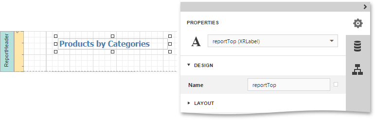
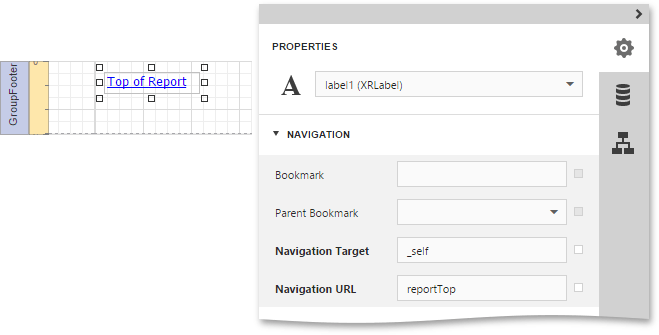
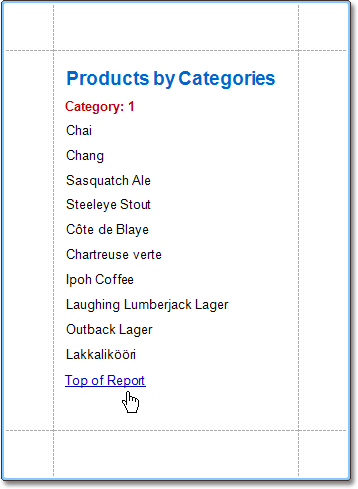

# Add a Cross-Reference
This document describes how to add a _cross-reference_ to your report. A cross-reference is simply a link whose target is located within the current document, which allows you to establish easy navigation through a report. In this example, we place a link at the bottom of each group, leading to the beginning of the report.

To demonstrate this feature,  use a report with grouping similar to the one created in the following tutorial: [Grouping Data](../shaping-data/grouping-data.md).

To create a report with cross-references, do the following.
1. Select the [Report Controls](../../report-elements/report-controls.md) in the [Report Header band](../../report-elements/report-bands.md), and in the [Properties Panel](../../interface-elements/properties-panel.md), expand the **Design** category and set the **Name** property to **reportTop**.
	
	
2. To accompany the existing Group Header with the corresponding Footer, [add](../basic-operations/create-report-elements.md) a Group Footer band.
3. Then, drop a label onto the Group Footer band. As it will be the link, change its **Text** to **Top of Report**, and apply the desired formatting to it (e.g., the blue color and underlined text).
	
	Expand the **Navigation** section and set the **Navigation Target** property to **_self** and the **Navigation URL** property to **reportTop**.
	
	

The report with cross-references is now ready. Switch your report to the [Preview](../../document-preview.md) mode and view the result.

