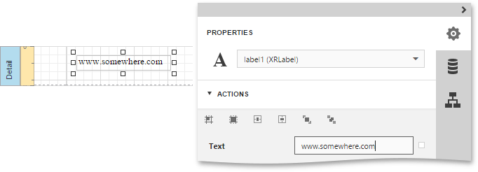
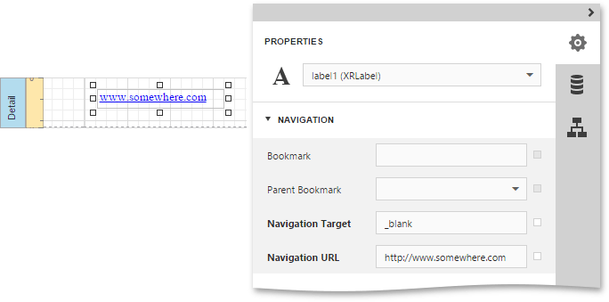
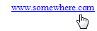

# Create Hyperlinks
This tutorial demonstrates how to embed a _hyperlink_ into your report. Note that a label will behave as a hyperlink both in a report's [Print preview](../../document-preview.md) and when the report is exported to PDF, HTML, MHT, RTF, XLS and XLSX.

To insert a hyperlink into your report, do the following.
1. [Create a new report](../basic-operations/create-a-new-report.md).
2. Drop a [Label](../../report-elements/report-controls.md) onto a [report band](../../report-elements/report-bands.md), and in the [Properties Panel](../../interface-elements/properties-panel.md), change its **Text** to the one required for the link.
	
	
	
	In addition, to make the Label look like a typical link, you can change its appearance appropriately (e.g., make it blue and underlined).
3. Now, in the **Navigation** section, set its **Navigation Target** to the required value (__blank_, __parent_, __search_, __self_, or __top_) and define the required **Navigation URL**.
	
	

Your report with the hyperlink is now ready. Switch the report to the [Preview](../../document-preview.md) mode and view the result.

