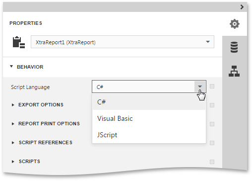
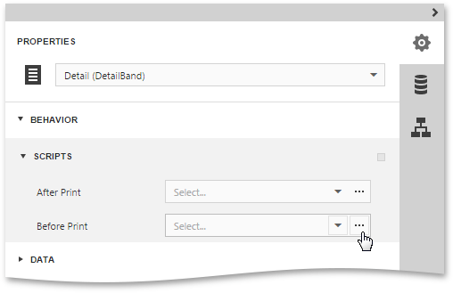
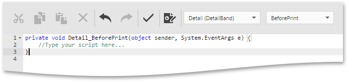

# Scripting
This document describes the basic principles of _scripting_, which can be performed by handling the events of a report, and its [bands](../report-elements/report-bands.md) and [controls](../report-elements/report-controls.md).

This documents consists of the following sections.
* [Scripting Overview](#overview)
* [Maintaining Scripts](#maintaining)
* [Example: Custom Summary](#example)

## <a name="overview"/>Scripting Overview
_Scripts_ are program commands, placed within the _event handlers_ of the required report elements. And when the corresponding event occurs (e.g., a mouse click), the script code runs. Scripting is made available to extend the standard functionality as far as may be required.

You can write _scripts_ for a report or any of its elements (bands and controls) to be executed when the report is being [previewed, printed or exported](../document-preview.md).

The [Web Report Designer](../../report-designer.md) allows you to write scripts using the [Script Editor](../interface-elements/script-editor.md). This editor supports **C#**, **Visual Basic .NET** and **JScript .NET** scripting languages. This means that the scripting language is independent from the language used to create the report. The language is specified by the **Script Language** property of a report. The selected scripting language must be the same for all scripts used in a report.



Note that JScript .NET is not installed with the .NET framework installation, by default, so you should make sure it is present before writing code in it.

## <a name="maintaining"/>Maintaining Scripts
Every report element has a set of script events, which are individual for each element type. To handle an event of a report element, do the following.
1. Select the required report element. In the [Properties Panel](../interface-elements/properties-panel.md), expand the **Behavior** category and then expand the **Scripts** section which lists available events.
	
	
2. Click the ellipsis button for an event (e.g., the **Before Print**, which is the most used). This will switch to the [Script Editor](../interface-elements/script-editor.md) , which allows you to manage and edit all the report scripts.
	
	
	
	Alternatively, you can click the **Scripts** button () located on the End-User Report Designer's [Main Toolbar](../interface-elements/main-toolbar.md). In the displayed [Script Editor](../interface-elements/script-editor.md), specify the report control and its event by the toolbar.
	
	After the event is specified, a code template is generated in the language specified with the **Script Language** property of the report.
3. To check for errors in the report's script, click the **Validate** button ().
	
	If an error is found, the string containing this error is marked with an  icon. When a mouse pointer hovers over this icon, the text of the error is displayed.
	
	

## <a name="example"/>Example: Custom Summary
In this example, we will display the total number of  product unit packs in a group.

To perform this, execute steps similar to the ones described in the [Calculating Summaries](shaping-data/calculating-summaries.md) topic, except that for the summary field, you should set the **Function** property to **Custom**.


Then, the additional events are added to the label's **Scripts** property.


You can handle these events in the following way.

**C#**

```csharp

// Declare a summary and a pack.
double totalUnits = 0;
double pack = 15;

private void label1_SummaryReset(object sender, System.EventArgs e) {
    // Reset the result each time a group is printed.
    totalUnits = 0;
}

private void label1_SummaryRowChanged(object sender, System.EventArgs e) {
    // Calculate a summary.
    totalUnits += Convert.ToDouble(GetCurrentColumnValue("UnitsOnOrder"));
}

private void label1_SummaryGetResult(object sender, 
DevExpress.XtraReports.UI.SummaryGetResultEventArgs e) {
    // Round the result, so that a pack will be taken into account 
    // even if it contains only one unit.
    e.Result = Math.Ceiling(totalUnits / pack);
    e.Handled = true;
}

```
**VB.NET**

```vb

' Declare a summary and a pack.
Private totalUnits As Double = 0
Private pack As Double = 15

Private Sub label1_SummaryReset(ByVal sender As Object, ByVal e As System.EventArgs)
    ' Reset the result each time a group is printed.
    totalUnits = 0
End Sub

Private Sub label1_SummaryRowChanged(ByVal sender As Object, ByVal e As System.EventArgs)
    ' Calculate a summary.
    totalUnits += Convert.ToDouble(GetCurrentColumnValue("UnitsOnOrder"))
End Sub

Private Sub label1_SummaryGetResult(ByVal sender As Object,  _ 
ByVal e As DevExpress.XtraReports.UI.SummaryGetResultEventArgs)
    ' Round the result, so that a pack will be taken into account 
    ' even if it contains only one unit.
    e.Result = Math.Ceiling(totalUnits / pack)
    e.Handled = True
End Sub

```

Switch to Print Preview and view the result.

