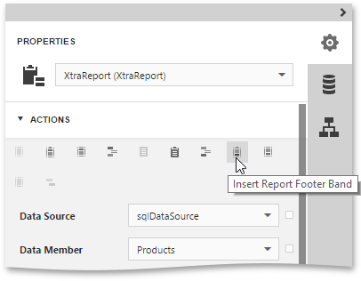
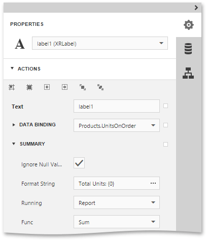

# Calculating Summaries
With Report Designer, you can force a [data-bound control](../../../../../interface-elements-for-web/articles/report-designer/creating-reports/providing-data/bind-report-controls-to-data.md) to calculate one of the standard summary functions (**Average**, **Sum**, **Count**, **Max**, **Min**, etc.)

To calculate summaries (totals) within a report, follow the instructions below.
1. [Create a new report](../../../../../interface-elements-for-web/articles/report-designer/creating-reports/basic-operations/create-a-new-report.md) and [bind it to a data source](../../../../../interface-elements-for-web/articles/report-designer/creating-reports/providing-data/bind-a-report-to-data.md). In this tutorial, we'll start with the following report layout.
	
	
2. To display a summary at the bottom of the report, [add](../../../../../interface-elements-for-web/articles/report-designer/creating-reports/basic-operations/create-report-elements.md) a [Report Footer](../../../../../interface-elements-for-web/articles/report-designer/report-elements/report-bands.md) band.
	
	
3. Switch to the [Field List](../../../../../interface-elements-for-web/articles/report-designer/interface-elements/field-list.md) panel, select the field for which a summary will be calculated and drop it onto the created Report Footer band.
	
	
4. Now, switch to the [Properties Panel](../../../../../interface-elements-for-web/articles/report-designer/interface-elements/properties-panel.md), select the newly created [Label](../../../../../interface-elements-for-web/articles/report-designer/report-elements/report-controls.md) and expand the **Actions** or **Data** category. In the **Summary** section, specify the arithmetic function and the report area, for which this arithmetic function is calculated.
	
	
	
	Set the **Func** property to **Sum**. Note that in addition to a simple summary, you can choose among numerous built-in functions (such as **Count** and **Average**).
	 
	
	Set the **Running** property to **Report**, so that the sum is calculated for the entire report.
	
	Select the **Ignore Null Values** checkbox, so that if a dataset contains such records, they will not affect the sum.
	
	You can also define a summary function's **Format String**. Note that value formatting is applied to a summary independent of general formatting and has priority over it too.

Switch your report to the [Preview](../../../../../interface-elements-for-web/articles/report-designer/document-preview.md) mode to view the result.

