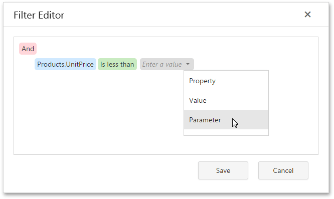

# Filtering Data
If the data source [bound](../../../../../interface-elements-for-web/articles/report-designer/creating-reports/providing-data/bind-a-report-to-data.md) to your report contains far more data rows than are necessary for processing report creation, you can exclude excessive or undesired data. To accomplish this, construct a filtering expression, using single or multiple data fields.

This document describes two approaches to filtering data with the [Web Report Designer](../../../../../interface-elements-for-web/articles/report-designer.md).
* [Filter Data at the Report Level](#report)
* [Filter Data at the Data Source Level](#datasource)

## <a name="report"/>Filter Data at the Report Level
To filter report data, switch to the [Properties Panel](../../../../../interface-elements-for-web/articles/report-designer/interface-elements/properties-panel.md), and in the **Actions** or **Data** category, click the ellipsis button for the report's **Filter String** property.

In the invoked [Filter Editor](../../../../../interface-elements-for-web/articles/report-designer/interface-elements/filter-editor.md), construct the filtering expression.

In every filter condition, the left part contains either the data field name, or the name of the [calculated field](../../../../../interface-elements-for-web/articles/report-designer/creating-reports/providing-data/calculated-fields.md), which exists in this data source at the same level. The right part of the condition contains either a certain numerical or string value, or the name of the [report parameters](../../../../../interface-elements-for-web/articles/report-designer/creating-reports/providing-data/report-parameters.md).
 

To access parameters, expand the drop-down menu for a value placeholder and select the **Parameter** item.

This will convert the value placeholder into a parameter placeholder. Click this placeholder to insert the required parameter.

## <a name="datasource"/>Filter Data at the Data Source Level
To filter data at the report data source level, do the following.
1. Invoke the [SQL Data Source Wizard](../../../../../interface-elements-for-web/articles/report-designer/wizards/sql-data-source-wizard.md). To run the wizard to customize an existing query, switch to the [Field List](../../../../../interface-elements-for-web/articles/report-designer/interface-elements/field-list.md) panel, select the required SQL query and click the **Edit query**  button.
2. On this wizard page, click **Run Query Builder...** to edit the SQL query.
	
	
3. In the invoked [Query Builder](../../../../../interface-elements-for-web/articles/report-designer/interface-elements/query-builder.md), specify a filtering expression that will be used to filter resulting data at the data source level. To do this, click the ellipsis button for the **Filter** property, and in the invoked [Filter Editor](../../../../../interface-elements-for-web/articles/report-designer/interface-elements/filter-editor.md), construct an expression.
	
	
	
	Note that it is possible to embed [query parameters](../../../../../interface-elements-for-web/articles/report-designer/creating-reports/providing-data/query-parameters.md) into the expression.