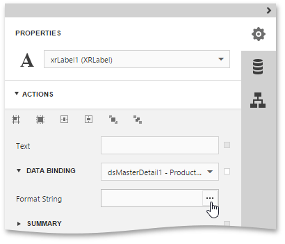

This topic describes how to change the value formatting of report elements in the [Web Report Designer](../../../../../interface-elements-for-web/articles/report-designer.md). For instance, you can format a numeric value as a currency, display a date/time value in one of the standard forms depending on the culture, etc.

To apply value formatting for a [data-bound control](../../../../../interface-elements-for-web/articles/report-designer/creating-reports/providing-data/bind-report-controls-to-data.md)'s content, locate this control and switch to the [Properties Panel](../../../../../interface-elements-for-web/articles/report-designer/interface-elements/properties-panel.md). Then, expand the **Actions** or **Data** category, and in the **Data Binding** section, click the ellipsis button for the **Format String** property.

The invoked [FormatString Editor](../../../../../interface-elements-for-web/articles/report-designer/interface-elements/format-string-editor.md) contains numerous built-in formatting presets grouped by categories. Select a required format or create a custom one, and click **OK**.

In a similar way, you can apply formatting to a control's **Bookmark**, **Navigation URL** and **Tag** properties. Note that the set of bindable properties depends on the control type.

When a summary function is applied to a control's dynamic content, value formatting is specified separately as described in the [Calculating Summaries](../../../../../interface-elements-for-web/articles/report-designer/creating-reports/shaping-data/calculating-summaries.md) document.

Independently from the general and summary value formatting, you can specify a native XSLX format string, which is to be preserved when the report is being [exported](../../../../../interface-elements-for-web/articles/document-viewer/html5-document-viewer/exporting/export-a-document.md) to XLSX. You can do this using a control's **Xlsx Format String** property.