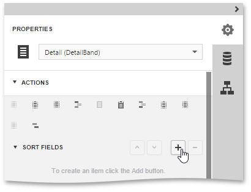
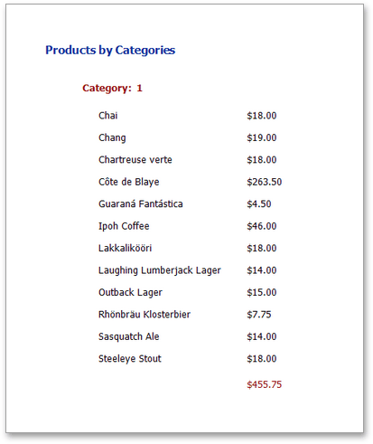

This document demonstrates how to sort data within a report's detail area and within groups. Note that as with data grouping, sorting can be performed only if a report is [bound to a data source](../../../../../interface-elements-for-web/articles/report-designer/creating-reports/providing-data/bind-a-report-to-data.md). In this example, we'll use the report created in the following tutorial: [Grouping Data](../../../../../interface-elements-for-web/articles/report-designer/creating-reports/shaping-data/grouping-data.md).

To sort records in a data-aware report, do the following.
1. Select the [Detail Band](../../../../../interface-elements-for-web/articles/report-designer/report-elements/report-bands.md) and expand the **Actions** category. Then, in the **Sort Fields** section, click the **Add** button to add a new sorting.
	
	
2. Now, choose a data member across which the report is to be sorted. Note that sorting across [calculated fields](../../../../../interface-elements-for-web/articles/report-designer/creating-reports/providing-data/calculated-fields.md) is supported as well.
	
	
3. To manage the sorting order, use the arrow button for the **Sort By** drop-down list. The  and  icons indicate the ascending and descending sorting order, respectively. To disable sorting, click this button until it is marked with the  icon.
	
	If multiple sorting criteria are specified, you can define the priority for each one, using the **Move Up**  and **Move Down**  buttons.

Sorting is now applied. Switch your report to the [Preview](../../../../../interface-elements-for-web/articles/report-designer/document-preview.md) mode and view the result.

