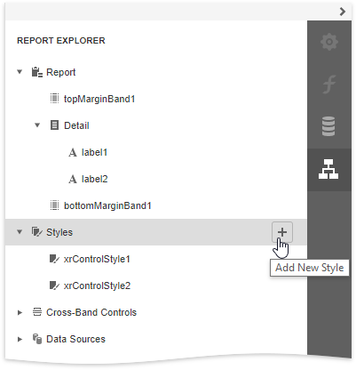
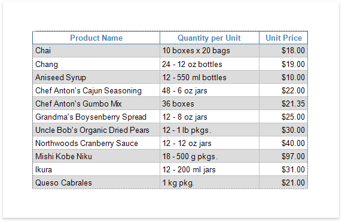
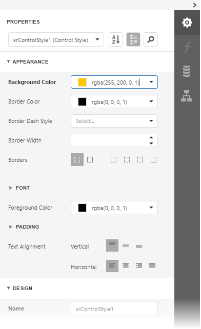

# Report Visual Styles

This topic describes how to combine [appearance properties](appearance-properties.md) into styles and apply them to report elements.

## Create a Report Style

Use the following approaches to create a visual style in your report:

- **Use the Properties Panel**

    Expand the [Properties](../report-designer-tools/ui-panels/properties-panel.md) panel's **Styles** category, click the drop-down list for the **Style** property and select **Create a New Style**. 
    
    

- **Use the Report Explorer**
    
    Switch to the [Report Explorer](../report-designer-tools/ui-panels/report-explorer.md) panel, select the **Styles** node and click the plus button  to add a new report visual style.

    

    To access the collection of added report visual styles, expand the **Styles** category in the [Report Explorer](../report-designer-tools/ui-panels/report-explorer.md).

## Assign a Style to a Report Element

Drag a report style from the Report Explorer onto a report control. This assigns the style to the report element's **Style** property.

## Assign Odd and Even Styles

You can use the **Odd Style** and **Even Style** properties to apply different styles to alternating rows in a report.

## Customize a Style

Select a style and click the **Properties**  button in the Report Explorer. 

This opens the Properties panel where you can adjust the settings of the selected style. All the report elements apply the updated style immediately.

## Style Inheritance

Nested elements inherit their parent element's style if they do not have an applied style. 

## Override Styles

You can specify a different value for a report element's appearance property to override the corresponding property value in the report element's style.

> [!NOTE]
> If you apply [conditional formatting](../shape-report-data/specify-conditions-for-report-elements/conditionally-change-a-control-appearance.md), its appearance property values have a higher priority than both the individually specified properties and the style's properties.

