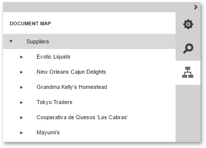

# Document Map Panel
The **Document Map Panel** is available in the Document Preview of the Web Report Designer when any [bookmarks](../creating-reports/report-navigation-and-interactivity/create-a-document-map-with-bookmarks.md) are assigned to the report elements.

The Document Map displays the hierarchy of bookmarks assigned to report elements.

Clicking a specific entry in the Document Map will navigate you to the corresponding element in the document.