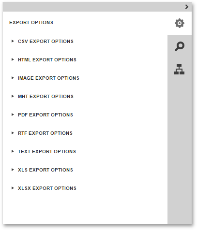

# Export Options Panel
The **Export Options** panel allows you to view and edit format-specific options required for exporting a report to one of the supported third-party formats.

The options are allocated in groups by an export format to which they are applied. To customize export options, expand the required options group by clicking on its header, and specify the required options.

