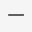

# Preview Toolbar
The **Preview Toolbar** provides quick access to the commands related to report viewing and publishing.

The Preview Toolbar commands are divided into the following sections by their intended use.
* [Navigation Commands](#navigation)
* [View Commands](#view)
* [Interaction Commands](#interaction)
* [Print and Export Commands](#export)
* [Search Command](#search)
* [Mode Command](#mode)

## <a name="navigation"/>Navigation Commands
The commands in this section are used to navigate through the resulting report.

| Command | Icon | Description |
|---|---|---|
| Previous page |  | Switches to the previous report page. |
| Next page |  | Switches to the next report page. |
| First page |  | Switches to the first report page. |
| Last page |  | Switches to the last report page. |
| Page factor |  | Navigates to a specific page. |

## <a name="view"/>View Commands
The commands in this section are used to adjust the view in the Web Report Designer.

| Command | Icon | Description |
|---|---|---|
| Zoom In |  | Increases the document's current zoom factor by 1 percent. |
| Zoom Out |  | Decreases the document's current zoom factor by 1 percent. |
| Zoom Factor |  | Zooms to a specific zoom factor from the drop-down list. |
| Toggle Multipage mode |  | Displays several report pages together in the multipage mode. |

## <a name="interaction"/>Interaction Commands
The only command in this section is used to maintain the interactive capabilities of previewed reports.

| Command | Icon | Description |
|---|---|---|
| Highlight Editing Fields |  | Highlights all editing fields to quickly discover which of the document elements are editable. |

## <a name="export"/>Print and Export Commands
The commands in this section are used to print an entire report or its current page, and export a report into one of the supported third-party formats.

| Command | Icon | Description |
|---|---|---|
| Print |  | Initiates report printing. |
| Print Page |  | Initiates printing of a report's current page. |
| Export to |  | Exports a report into one of the supported third-party formats. |

<a name="search"/>

## Search Command
The command in this section is used to show the Search panel.

| Command | Icon | Description |
|---|---|---|
| Search |  | Shows the Search panel, which allows users to find a specified text throughout a document. |

## <a name="mode"/>Mode Command
The command in this section is used for switching the Web Report Designer operation mode.

| Command | Icon | Description |
|---|---|---|
| Design |  | Activates the Design mode. |