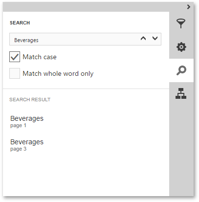

# Search Panel
The **Search Panel** enables you to find specific text in a document with specified search options.

Once occurrences of the specified string are found, they are listed in the search results. Clicking a search result will navigate you to the corresponding entry in the document.

When the [Document Map](document-map-panel.md) is available, it is filtered to display only those document sections that contain the found entries.