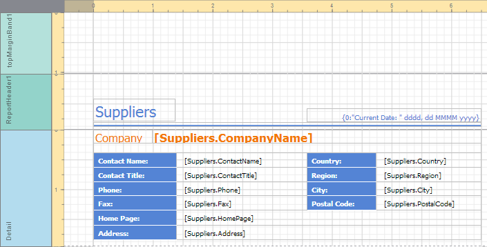
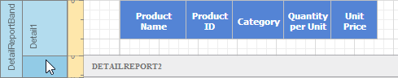

# Design Surface
The **Design Surface** displays a report that is being edited in the [Web Report Designer](../../../../interface-elements-for-web/articles/report-designer.md).

The Design Surface includes the following principal elements.
* [Rulers](#rulers)
* [Band Captions](#bandcaptions)
* [In-Place Editor](#inplaceeditor)

## <a name="rulers"/>Rulers
The horizontal and vertical rulers display tickmarks in the [measure units](../../../../interface-elements-for-web/articles/report-designer/creating-reports/basic-operations/change-measurement-units-of-a-report.md) specified for your report. Click an element to evaluate its size and location using the rulers.

The horizontal ruler also allows you to modify report side margins by moving the left and right sliders on the ruler.

The vertical ruler shows resizing rectangles for every report band, which you can move to change the band height.

## <a name="bandcaptions"/>Band Captions
In the Report Designer, each [report band](../../../../interface-elements-for-web/articles/report-designer/report-elements/report-bands.md) carries a caption, the tab title and color, which depends on the band kind. These captions are not printed in the resultant report document and are only visible at design time.

You can expand or collapse band content at design time by clicking the tab at the left side of the band. To access the properties of a band, select the band by clicking its caption, and then switch to the [Properties Panel](../../../../interface-elements-for-web/articles/report-designer/interface-elements/properties-panel.md).

To learn more, see the [Report Bands](../../../../interface-elements-for-web/articles/report-designer/report-elements/report-bands.md) topic.

## <a name="inplaceeditor"/>In-Place Editor
Allows you to edit the content of a text-oriented [Report Controls](../../../../interface-elements-for-web/articles/report-designer/report-elements/report-controls.md) (Bar Code, Check Box, Label, Rich Text, or Zip Code) by double-clicking it.

> The current Web Report Designer version does not support the in-place editing of rich text in the [Rich Text](../../../../interface-elements-for-web/articles/report-designer/report-elements/report-controls.md) control. Only plain text editor is available for this report control.

To toggle between the Design and Preview mode of a report, use the corresponding buttons of the [Main Toolbar](../../../../interface-elements-for-web/articles/report-designer/interface-elements/main-toolbar.md).