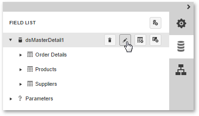

# Master-Detail Relation Editor
When a data source contains two or more [queries](../../../../interface-elements-for-web/articles/report-designer/wizards/sql-data-source-wizard/adding-a-new-data-source/create-a-query-or-select-a-stored-procedure.md), clicking the  button in the [Field List](../../../../interface-elements-for-web/articles/report-designer/interface-elements/field-list.md) will invoke the **Master-Detail Relation Editor**.

Using this editor, you can define master-detail relationships between queries by specifying their corresponding key fields.

This allows you to create hierarchical data sources that are used to create nested [master-detail reports](../../../../interface-elements-for-web/articles/report-designer/report-types/master-detail-report-(detail-report-bands).md).

> Although it is also possible to [join different tables](../../../../interface-elements-for-web/articles/report-designer/interface-elements/query-builder.md) within a single query, creating hierarchical data sources is preferred in most cases to provide better performance (in general, master-detail reports are generated faster than similar-looking reports created by grouping "flat" data sources).