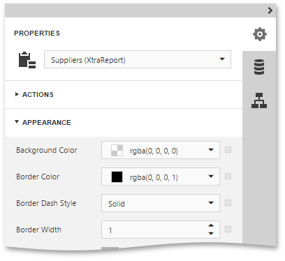
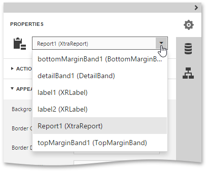
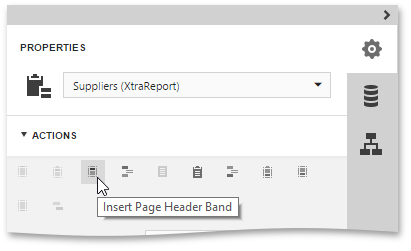
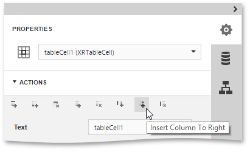

# Properties Panel
The **Properties** panel allows you to access and edit the settings of a report and its elements.

This topic consists of the following section.
* [Select a Report Element](#selectelement)
* [Set Property Values](#setproperties)
* [Reset Property Values](#resetproperties)
* [Use Actions](#actions)

## <a name="selectelement"/>Select a Report Element
To select a report element and show its settings in the **Properties** panel, do one of the following.
* Select a required element in the drop-down list at the top of the **Properties** panel.
	
	
* Click a required element in the [Design Surface](../../../../interface-elements-for-web/articles/report-designer/interface-elements/design-surface.md) and invoke the **Properties** panel by clicking the  button.
* Select a required element in the [Report Explorer](../../../../interface-elements-for-web/articles/report-designer/interface-elements/report-explorer.md) and click the  button.

## <a name="setproperties"/>Set Property Values
In this panel, the properties of a currently selected report element are arranged in categories. To set a property value, expand the corresponding category by clicking its header and specify the necessary value using the property editor.

Specific properties can contain nested properties, which can be accessed by clicking the corresponding property header.

## <a name="resetproperties"/>Reset Property Values
To restore the default value of a property, click the  button to the right of the editor, and in the invoked popup menu, select **Reset**.

## <a name="actions"/>Use Actions
The context-sensitive **Actions** category at the top of the Properties panel displays the most commonly used actions corresponding to the selected report element or a report.
* If a report is selected, this category allows you to add new [bands](../../../../interface-elements-for-web/articles/report-designer/report-elements/report-bands.md) of particular types.
	
	
* If you select a table element, this category provides actions to manage cells, rows and columns.
	
	
* For elements of other types and for multiple selected report elements, you can use actions to align and position these elements (e.g., align and resize elements to the snap grid, specify the horizontal and vertical alignments, etc.)
	
	