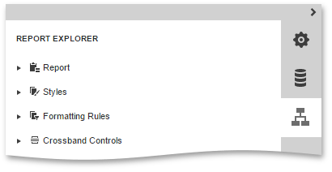
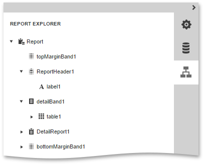

# Report Explorer
This document describes the **Report Explorer** panel that shows a report's structure providing quick access to report elements, styles and formatting rules.

This document consists of the following sections.
* [Manage Report Elements](#reportelements)
* [Manage Report Styles and Formatting Rules](#stylesandformatting)

## <a name="reportelements"/>Manage Report Elements
The Report Explorer displays all [report controls](../../../../interface-elements-for-web/articles/report-designer/report-elements/report-controls.md) and [bands](../../../../interface-elements-for-web/articles/report-designer/report-elements/report-bands.md) in a tree-like form and allows you to easily manage them.

The following actions are available for report element customization.

| Button | Description |
|---|---|
|  | Removes the selected report element. This button is not available for the **Detail**, **TopMargin** and **BottomMargin** bands. |
|  | Switches to the [Properties Panel](../../../../interface-elements-for-web/articles/report-designer/interface-elements/properties-panel.md) where you can adjust the settings of the selected report element or a report itself. |

## <a name="stylesandformatting"/>Manage Report Styles and Formatting Rules
To access the collection of [report styles](../../../../interface-elements-for-web/articles/report-designer/creating-reports/appearance-customization/understanding-style-concepts.md) or [formatting rules](../../../../interface-elements-for-web/articles/report-designer/creating-reports/appearance-customization/conditionally-change-a-control's-appearance.md), expand the corresponding category in the Report Explorer.

To apply a style or formatting rule to a report control, drag it from the Report Explorer onto the required report control.

The following actions are available in the Report Explorer for customization styles and formatting rules.

| Button | Description |
|---|---|
|  | Creates a new style or formatting rule. |
|  | Removes the selected style or formatting rule. |
|  | Switches to the [Properties Panel](../../../../interface-elements-for-web/articles/report-designer/interface-elements/properties-panel.md) where you can adjust the settings of the selected style or formatting rule. |