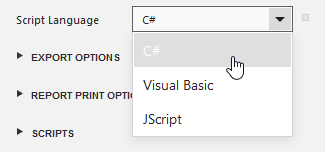
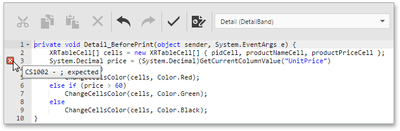

# Script Editor
The **Script Editor** allows end-users to write code for specific event handlers in the [End-User Report Designer](../../../../interface-elements-for-web/articles/report-designer.md) to adjust the behavior of report controls, bands, or a report itself. This topic describes the basic principles of using [scripts](../../../../interface-elements-for-web/articles/report-designer/creating-reports/scripting.md) in XtraReports, the Script Editor interface, and shows how scripting can be used in a report.

This document consists of the following sections.
* [Overview](#overview)
* [Maintaining Scripts](#maintaining)

## <a name="overview"/>Overview
The Script Editor provides end-users with the capability to write and execute scripts at runtime when a report is generated. Note that although it's possible to add scripts in both the Visual Studio IDE and in the End-User Report Designer, this feature is primarily intended to be used by advanced end-users who want to slightly customize a report in the End-User Report Designer.
 

The Script Editor supports **C#**, **Visual Basic .NET** and **JScript .NET** scripting languages. This means that the scripting language is independent from the language used to create the report. The language is specified by the **Script Language** property of a report. The selected scripting language must be the same for all scripts used in a report.

The Script Editor supports intelligent code completion that makes it easier and faster for you to write scripts. Context-aware hints are displayed on pressing CTRL+spacebar. This feature is only supported for the **C#** and **Visual Basic .NET** script languages.

## <a name="maintaining"/>Maintaining Scripts
Each report element has its own set of events that can be handled by the Script Editor. To handle an event of a [report element](../../../../interface-elements-for-web/articles/report-designer/report-elements.md), do the following.
1. Click the **Scripts** button () located on the End-User Report Designer's [Main Toolbar](../../../../interface-elements-for-web/articles/report-designer/interface-elements/main-toolbar.md).
2. In the displayed Script Editor, specify the report control and its event by the toolbar. The toolbar contains all scripts written for all report elements, and allows you to quickly navigate through them by choosing the required report element in the corresponding drop-down list and by specifying one of its available events in another menu.
	
	
	
	After the event is specified, a code template is generated in the current scripting language.
3. To check for errors in the report's script, click the **Validate** button ().
	
	If an error is found, the string containing this error is marked with an  icon. When a mouse pointer hovers over this icon, the text of the error is displayed.
	
	