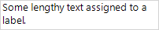
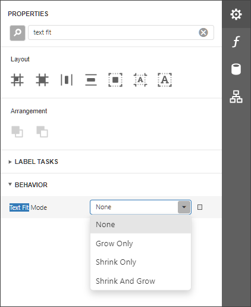
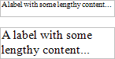

# Maintain the Size and Content of Data-Bound Controls

Use the control's **Can Grow** and **Can Shrink** properties to make a data-bound control automatically adjust its height to its contents.

| **Can Grow = No** | **Can Grow = Yes** |
|---|---|
|  |  |

| **Can Shrink = No** | **Can Shrink = Yes** |
|---|---|
|  |  |

> [!NOTE]
> This feature does not work with [anchoring](anchor-controls.md) enabled, as well as for labels that are used to display [summary function results](../shape-report-data/calculate-summaries/calculate-a-summary.md).

Use the **Auto Width** property to make a data-bound [Label](../use-report-elements/use-basic-report-controls/label.md) or [Character Comb](../use-report-elements/use-basic-report-controls/character-comb.md) automatically adjust its width to its content. This option behavior depends on the control's current horizontal alignment (**Text Alignment** property value).

* **Text Alignment = Left**

    

* **Text Alignment = Right**

    

* **Text Alignment = Center**

    

The control's **Word Wrap** property allows you to make a control display its contents in multiple lines when it does not fit into the control's dimensions.

| Auto Width = No, Word Wrap = No | Auto Width = No, Word Wrap = Yes |
|---|---|
|  |  |

| Auto Width = Yes, Word Wrap = No | Auto Width = Yes, Word Wrap = Yes |
|---|---|
|  |  |

You can also use the opposite **Text Fit Mode** property to adjust a label or table cell's font size to fit the control's bounds. Images below show how the **Text Fit Mode** property affects the label's font size.

 

| Text Fit Mode = None | Text Fit Mode = Grow Only | Text Fit Mode = Shrink Only | Text Fit Mode = Shrink And Grow |
|---|---|---|---|
|  |  |  |  |

This property is not available in the following cases:

* The **Can Grow**, **Can Shrink** or **Auto Width** option is enabled;
* The label's **Angle** property is specified;
* The control's **Anchor Horizontally** or **Anchor Vertically** property is set to **Both**.