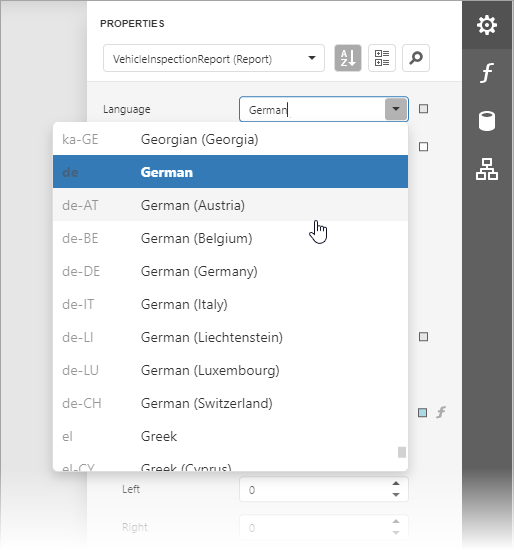
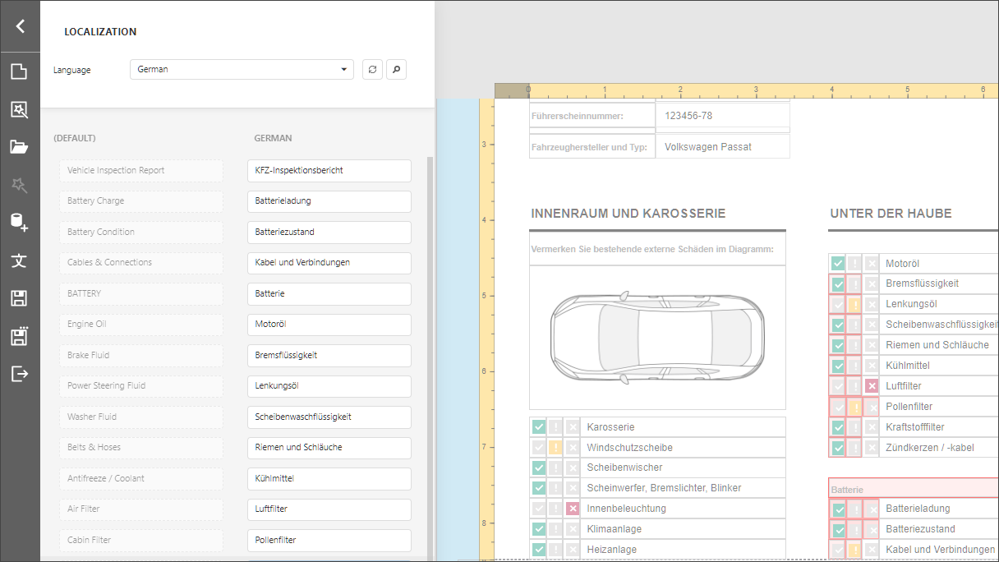

# Localize Reports

The Report Designer enables you to localize a report for different languages and cultures and save localized values to the report file.

## Use Properties Panel

Perform the following actions to localize a report:

1. Specify a report language other than _Default_:

    

    The **Language** drop-down list contains all available locales. The report's languages are highlighted in bold.

2. Change the controls' property values. You can move and resize a control.

    

3. Save the report.

When you load a localized report, use the **Language** drop-down list to switch to the localized version.

## Use Localization Editor

The [Localization Editor](report-designer-tools/localization-editor.md) allows you to change text strings in the report and expedite the translation process.

