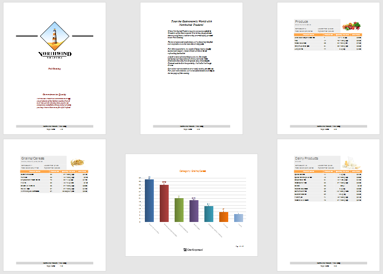

# Merge Reports

You may have report pages that do not fit within an entire report template in the following cases:

* [Title pages or custom pages at the end of the report](merge-reports/add-a-report-to-the-end-beginning.md);
* [Charts within a table report](merge-reports/use-data-driven-page-sequence.md);

You can create pages in a separate report and merge them into your base report. This enables you to print and export merged pages as a single document, and preserve the original report page settings and orientation.

