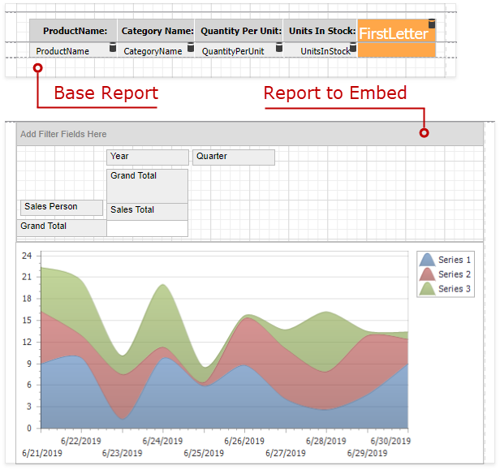
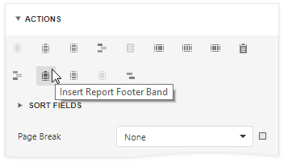
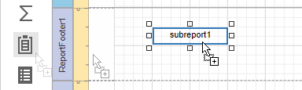
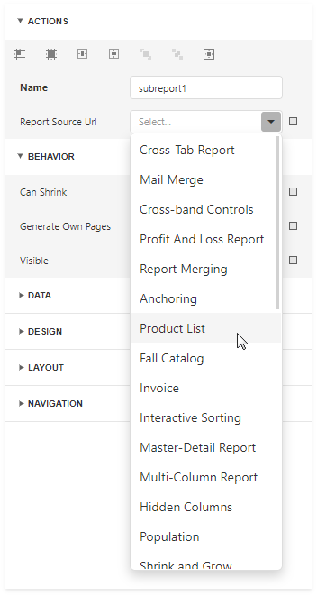
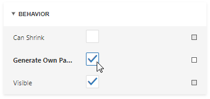
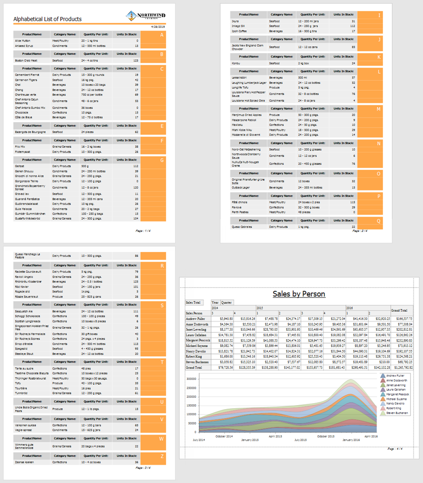

# Add a Report to the End/Beginning

Follow the steps below to add a separate report to the end of another report and print it as a single job.

1. Click **Insert Report Footer Band** in the **Actions** panel.

	

1. Drag a [Subreport](../use-report-elements/use-basic-report-controls/subreport.md) item from the Toolbox onto the created Report Footer band.

	

    > [!Tip]
    > To add a report to the beginning of another report (for instance, to add a title page), use the **Report Header** band instead.

1. In the Subreport's **Actions** panel, set the **Report Source Url** parameter to the report that you want to insert.

    

1. Enable the **Generate Own Pages** option in the Subreport's **Behavior** panel to print the embedded report on separate pages and use its own page settings.

    

1. Switch to Preview mode to see the combined report.

    
