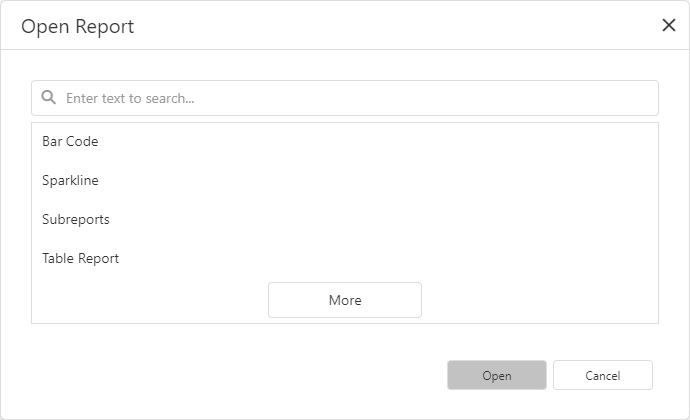

# Open Reports

Click **Open** in the [menu](report-designer-tools/menu.md) to invoke the **Open Report** dialog. 

The dialog displays reports from the report storage. You can enter text in the search field to filter the report list.  
Select a report and click **Open**.

You can use the **Open Report** dialog to search for a report.

