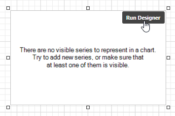
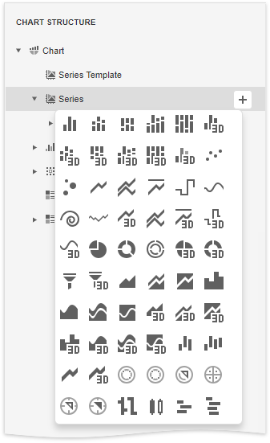
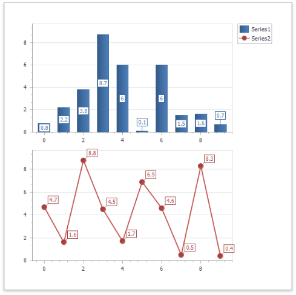
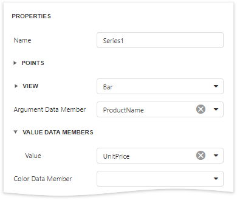

# Chart Designer

## Chart Designer Overview

The **Chart Designer** allows you to quickly create and customize [charts](../use-report-elements/use-charts.md) in the [End-User Report Designer](../../report-designer.md).

To invoke the Chart Designer, click the **Run Designer** button over the chart control.

The Chart Designer consists of three main parts that are described below.

## Chart Structure

The **Chart Structure** tree enables you to explore and manage a structure of a chart and its elements.

When you click a chart element in the tree, the designer's **Properties** panel displays settings of this element.

To create a new series, click the plus  button for the **Series** collection and select a required series type in the invoked window.

To add elements to other collections (**Titles**, **Legends**, etc.), simply click the plus  button.

To delete an element, select it and click the **Remove**  .

## Chart Layout

The **Chart Layout** area displays the preview of the created chart.

This part also provides the following buttons:

| Icon | Description |
|---|---|
|| Reverses the most recent action. |
|| Performs the action you have previously undone. |

##Chart Properties

The **Properties** panel allows you to view and change settings of a chart and its elements. Changing any property updates the chart layout to display the current state.

