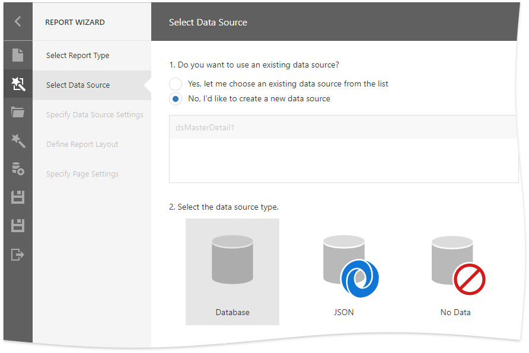

# Data Source Wizard 

The Data Source Wizard enables you to add data sources to a report.

This wizard is available in the Report Designer if you registered the corresponding data connections.

Click the **Add Data Source...** command in the Designer's menu to run the Data Source Wizard.

On the start page, choose the data source type and click **Next** to proceed:

* [Spesify Data Source Setting (Database)](data-source-wizard/specify-data-source-settings-database.md) if you selected **Database**;
* [Spesify Data Sourse Setting (JSON)](data-source-wizard/specify-data-source-settings-json.md) if you selected **JSON**.