# Specify Data Source Settings (Database)

This page appears if you selected **Database** on the start page. 

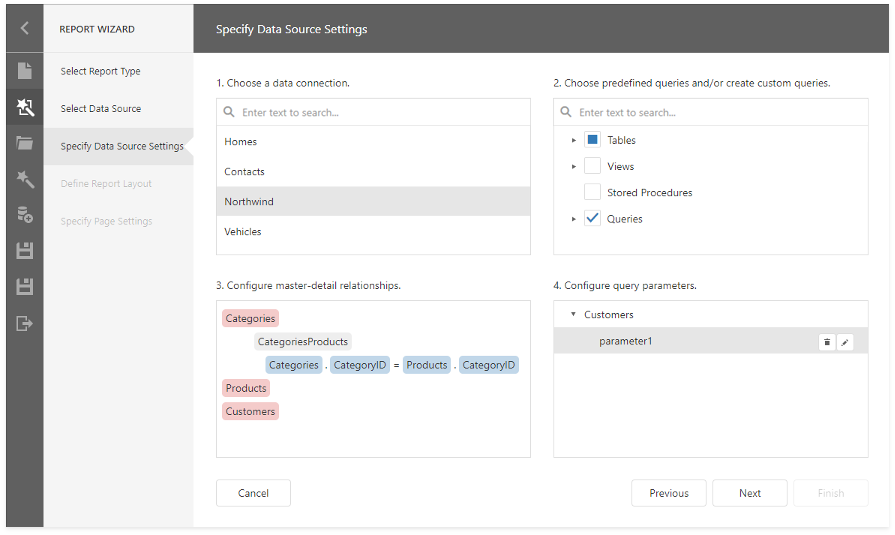

## Choose a Data Connection

Select a data connection from the list.

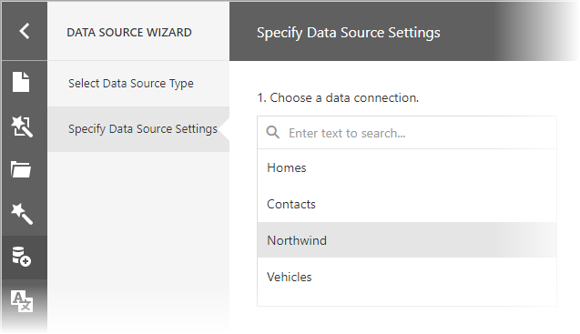

## Choose Queries

Check tables, views and/or stored procedures to include them in a data source as separated queries.

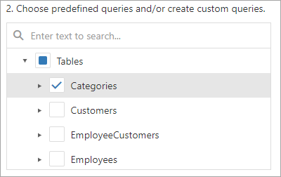

You can also check specific data fields.

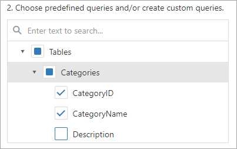

To join multiple data tables and shape the resulting data, click the **Queries** category's plus button to invoke the [Query Builder](../query-builder.md) and create a custom query.

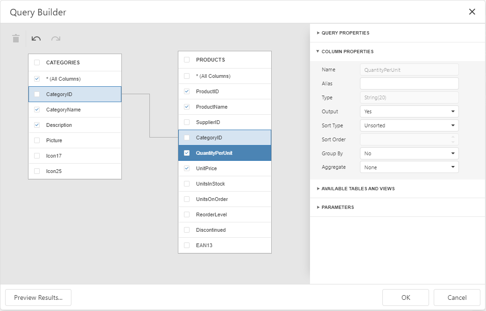

If you enabled custom SQL queries, the plus button invokes a context menu. You can choose whether to run the Query Builder or Custom SQL Editor.

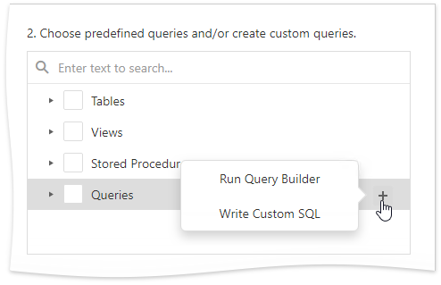

You can click the  button to customize the query or the  button to remove the query.

Once you finished the wizard, the data source becomes available in the [Report Explorer](../ui-panels/report-explorer.md)'s **Components** node. The [Field List](../ui-panels/field-list.md) reflects the data source structure.

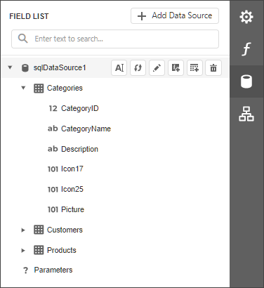

## Configure Master-Detail Relationships

This step is available when you selected two or more queries. 

To create a master-detail relationship, click the master table's plus button, select the detail table in the invoked list, and connect the key fields.

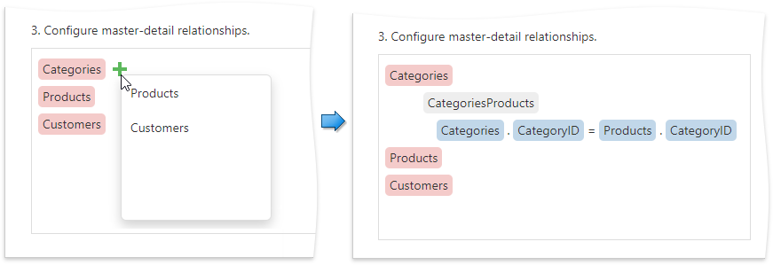

After the wizard is completed, the Field List reflects the master-detail hierarchy.

## Configure Query Parameters

This step is available if you selected a parameterized stored procedure or created a custom query.

Select a query and click the plus button to add a new parameter.

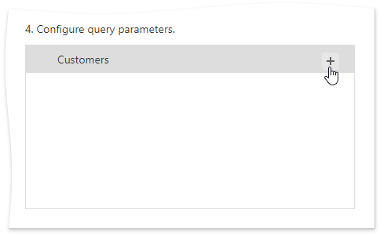

Click the  button to customize the parameter or the  button to remove it.

You can use the following approaches to specify a parameter value:

* **Assign a static value**

    Select a query parameter's type from the **Type** drop-down list and specify a value based on the selected type.

    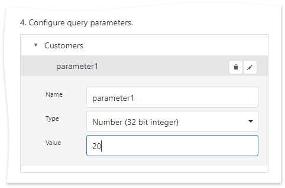

* **Provide a dynamic parameter value** 

    Set the **Type** option to **Expression** and specify the **Result Type**. Click the **Value** option's ellipsis button and construct an expression in the invoked.

    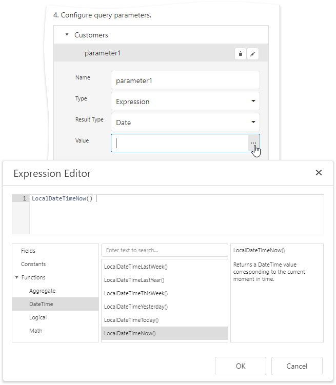

    If you design the current report in the wizard, you can map a query parameter to an existing report parameter. To do this, use the **?parameterName** syntax.

    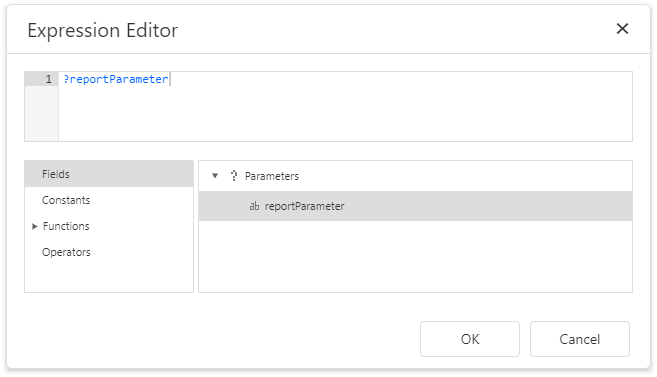
