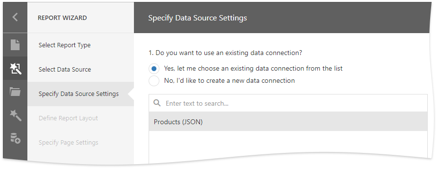

# Specify Data Source Settings (JSON)

This page appears if you selected **JSON** on the start page. 

## Select an Existing Data Connection

Select the first option and choose a data connection from the list.

## Create a New Data Connection

Select the second option to create a new connection.

Specify the connection name and select the JSON source type.

* **Web Service Endpoint (URI)**

    

    You can also specify the Web Service Endpoint's request parameters (username and password, path parameters, query parameters, or header parameters).

    

* **JSON String**

    

    You can also use the **Upload JSON** button to load content from the selected JSON file.

## Select Data Fields

At this step, the wizard shows the JSON schema. Check the data fields you want to include in your report.

Click **Next** to proceed.

