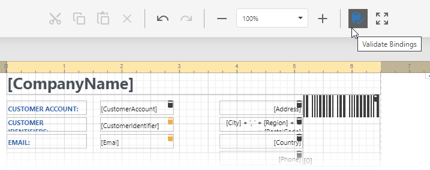

# Design Surface

The **Design Surface** displays a report that is being edited in the [Web Report Designer](../../report-designer.md).

## Rulers

The horizontal and vertical rulers display tickmarks in your report's specified [measurement units](../configure-design-settings/change-a-report-measurement-units.md). Click an element to evaluate its size and location using the rulers.

The horizontal ruler also allows you to modify the report's side margins (the report's **Margins** property value) by moving the left and right sliders on the ruler.

You can move a report band's vertical ruler resizing rectangles to change its height.

## Band Captions

In the Report Designer, each [report band](../introduction-to-banded-reports.md) carries a caption, the tab title and color, which depends on the band kind. These captions are not printed in the resultant report document and are only visible at design time.

You can expand or collapse a band's content at design time by clicking the tab on the left side of the band.

To access a band's properties, click the band's caption and switch to the [Properties Panel](ui-panels/properties-panel.md).

## Data Binding Indication

The Report Designer displays a database barrel icon above [data-bound](../use-report-elements/bind-controls-to-data.md) report controls.

You can click the [Validate Bindings](../use-report-elements/validate-report-data-bindings.md) toolbar button to highlight report controls with invalid [expression/data bindings](../use-expressions/data-binding-modes.md). This allows you to determine if the specified expression has an incorrect syntax or uses non-existing data source fields.

## In-Place Editors

In-place editors allow you to edit the text-oriented controls' content ([Barcode](../use-report-elements/use-bar-codes.md), [Character Comb](../use-report-elements/use-basic-report-controls/character-comb.md), [Check Box](../use-report-elements/use-basic-report-controls/check-box.md), [Label](../use-report-elements/use-basic-report-controls/label.md), [Table Cell](../use-report-elements/use-tables.md)) by double-clicking them.

You can switch between a report's **Design** and **Preview** mode using the corresponding buttons in the [Main Toolbar](toolbar.md).