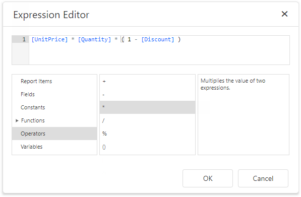
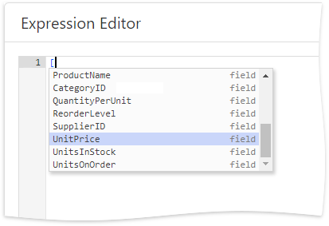
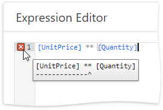
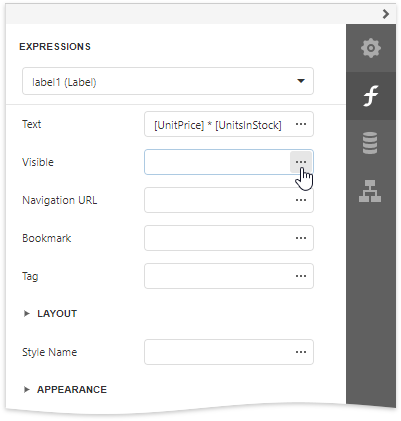
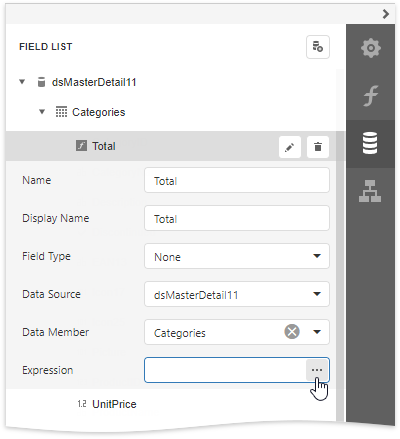
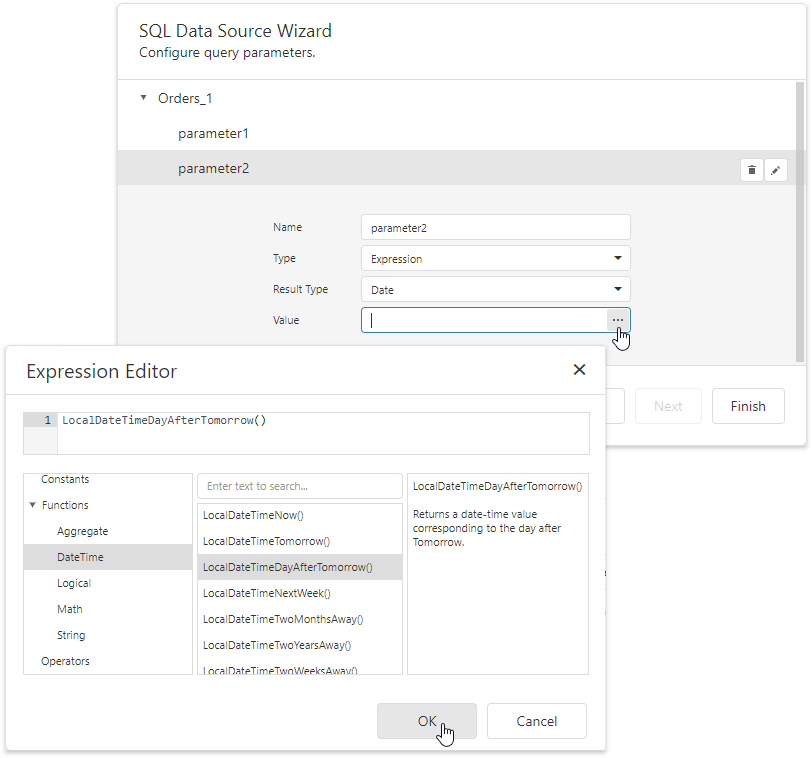
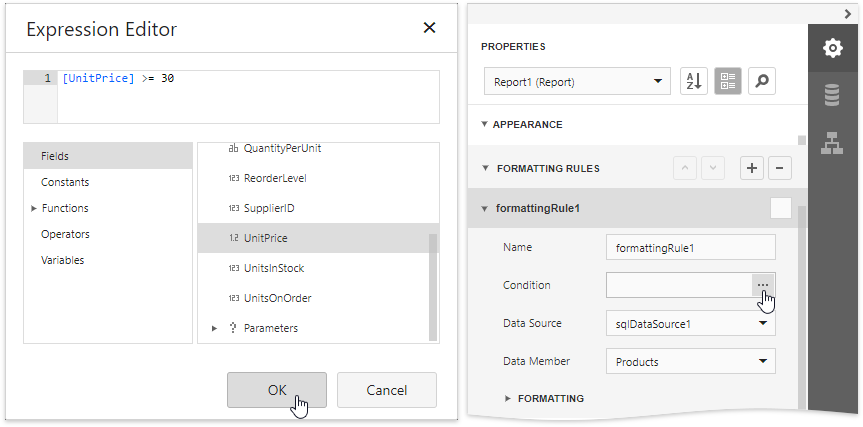

# Expression Editor
This document describes the **Expression Editor** used for constructing expressions in the [End-User Report Designer](../../report-designer.md).

## Expression Editor Overview

The Expression Editor provides a variety of aggregate, date-time, logical, math and string functions. You can also use logical and arithmetic operators, fields of a data source to which a report is bound, report elements, constants, and variables.

This editor supports syntax highlighting and intelligent code completion (suggesting functions and available data elements as you type).

An error icon appears if an expression contains any errors. Hovering over this icon with the mouse invokes the popup indicating the error's position.

## Expression Syntax

Take into account the following syntax conventions when using the Expression Editor:

* Reference a data field in the expression by enclosing its name in the square brackets (for example, **[ProductName]**).

* Insert [report parameters](../shape-report-data/use-report-parameters/parameters-overview.md) and [query parameters](../shape-report-data/use-report-parameters/use-query-parameters.md) by typing a question mark before their names (for instance, **?parameter1**).

* Denote string values with apostrophes. Type a double apostrophe to embed an apostrophe into an expression's text (for example, **'It''s sample text'**).

* Enclose date-time constants with hashtags (**[OrderDate] >= #1/1/2016#**).

* Use a question mark to specify a null reference (one that does not refer to any object) (**[Region] != ?**).

* If an expression involves the use of different types, you can convert them to the same type using dedicated functions (for instance, **Max(ToDecimal([Quantity]),[UnitPrice])**).

## Using the Expression Editor

When [expression bindings](../bind-to-data/bind-controls-to-data-expression-bindings.md) are enabled in your reports, the Report Designer contains the [Expressions](ui-panels/expressions-panel.md) tab allowing you to assign values to various element properties. Clicking any property's ellipsis button invokes the Expression Editor, in which you can specify custom expressions with the available data fields.

In the [data binding](../bind-to-data/bind-controls-to-data-data-bindings.md) mode, you can use the Expression Editor in the following cases:

* **Edit a Calculated Field's Expression**

    Access a [calculated field](../shape-report-data/use-calculated-fields/calculated-fields-overview.md)'s settings in the Field List and click **Expression** property's ellipsis button.

    

* **Specify a Query Parameter's Value**

    In the [Configure Query Parameters](data-source-wizard\specify-data-source-settings-database.md) wizard page, set the parameter type to **Expression** and click the **Value** property's the ellipsis button.

    

* **Construct a Formatting Rule's Condition**

    Access the [formatting rule](../shape-report-data/shape-data-data-bindings/conditionally-change-a-control-appearance.md)'s settings in the [Properties](ui-panels/properties-panel.md) panel and click the **Condition** property's ellipsis button.

    

