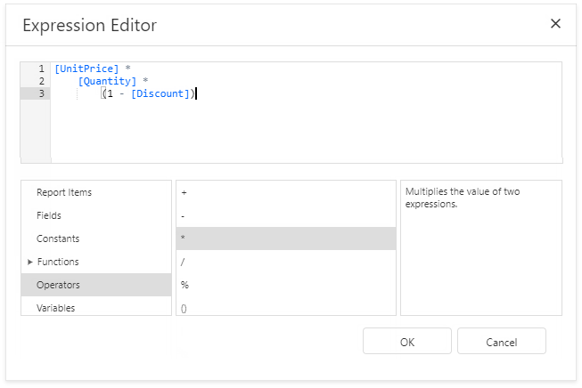
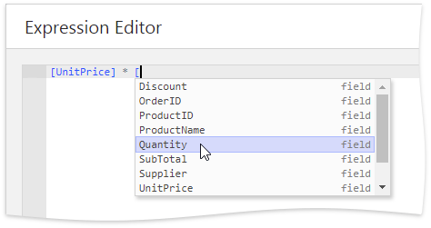
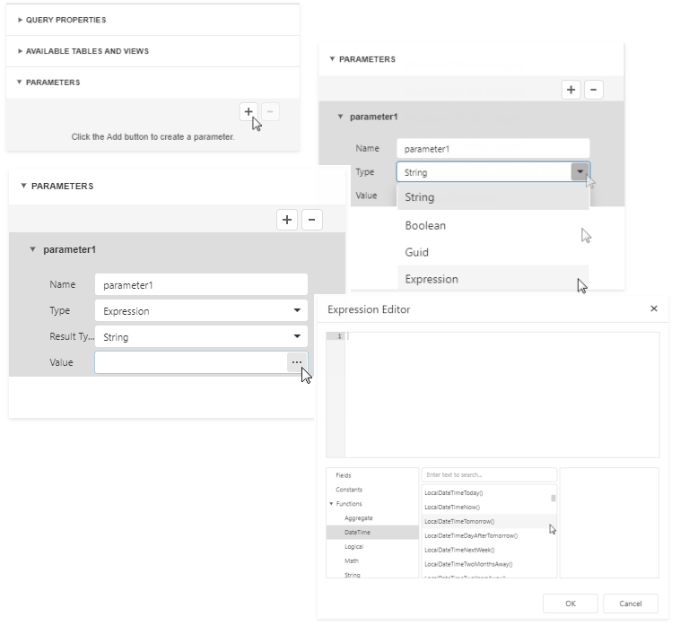

# Expression Editor

This document describes how to use the **Expression Editor** to specify expressions in the [Report Designer](../../report-designer.md).

Invoke the **Expression Editor** from a property's popup menu in the [Properties Panel](ui-panels/properties-panel.md). Click the property's marker and select the **_PropertyName_ Expression**.

If a property's editor displays an ellipsis button, you can click this button to invoke the **Expression Editor** and specify an expression that evaluates to the property's value.

The **Expression Editor** offers a choice of functions, operators, data source fields, report elements, constants, and variables to create an expression.

An expression can span multiple lines.

You can add single-line or multi-line comments in the following format: `/* comment text */`.

The **Expression Editor** highlights an expression's syntax and supports intelligent code completion (it suggests functions and available data elements as you type).

An error icon appears if an expression contains errors. Hover the mouse pointer over this icon to invoke a pop-up notification that shows the location of the error.

See the [Expression Language](../use-expressions/expression-language.md) topic for the expression syntax description.

## Expression Syntax

Take into account the following syntax conventions when using the Expression Editor:

* Reference a data field in the expression by enclosing its name in the square brackets (for example, **[ProductName]**).

* Insert [report parameters](../use-report-parameters.md) and [query parameters](../bind-to-data/specify-query-parameters.md) by typing a question mark before their names (for instance, **?parameter1**).

* Denote string values with apostrophes. Type a double apostrophe to embed an apostrophe into an expression's text (for example, **'It''s sample text'**).

* Enclose date-time constants with hashtags (**[OrderDate] >= #1/1/2016#**).

* Use a question mark to specify a null reference (one that does not refer to any object) (**[Region] != ?**).

* If an expression involves the use of different types, you can convert them to the same type using dedicated functions (for instance, **Max(ToDecimal([Quantity]),[UnitPrice])**).

## Using the Expression Editor

When [expression bindings](../use-report-elements/bind-controls-to-data.md) are enabled in your reports, the Report Designer contains the [Expressions](ui-panels/expressions-panel.md) tab allowing you to assign values to various element properties. Clicking any property's ellipsis button invokes the Expression Editor, in which you can specify custom expressions with the available data fields.

In the [data binding](../use-report-elements/bind-controls-to-data.md) mode, you can use the Expression Editor in the following cases:

* **Edit a Calculated Field's Expression**

    Access a [calculated field](../shape-report-data/use-calculated-fields/calculated-fields-overview.md)'s settings in the Field List and click **Expression** property's ellipsis button.

    

* **Specify a Query Parameter's Value**

    In the [Configure Query Parameters](data-source-wizard/specify-data-source-settings-database.md) wizard page, set the parameter type to **Expression** and click the **Value** property's the ellipsis button.

    

* **Construct a Formatting Rule's Condition**

    Access the [formatting rule](../shape-report-data/specify-conditions-for-report-elements/conditionally-change-a-control-appearance.md)'s settings in the [Properties](ui-panels/properties-panel.md) panel and click the **Condition** property's ellipsis button.

    

