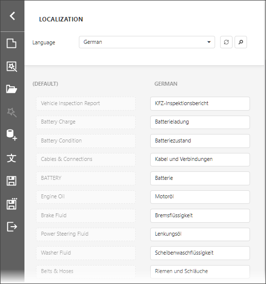
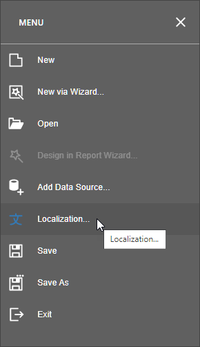

# Localization Editor

The Localization Editor allows you to change the text of the localizable textual properties for all the controls in a report.

The top panel allows you to change the report's language, add a new language to start localization or delete a language.

The main panel contains a grid that displays the text in the default language and the corresponding text in the selected language.  Each row represents the **Text** property of a report element. When you click a grid row, the Designer view navigates to the report element on the Report Designer surface and highlights the element

The text strings for the selected language are editable. When a user finishes editing text, the Report Designer displays the updated text.

## Invoke the Editor

Click **Localization** in the Report Designer menu:

## Use the Editor

1. Select the language in the combo box in the top panel. The languages with localization strings in the report are highlighted in bold.
2. Enter the text in the Search field in the top panel or scroll the main panel to find the text you want to change. The report's design surface scrolls to display the selected control and highlights it.
3. Enter the new text. The text is applied to the report control and reflected in the report layout.
4. Save the report.

